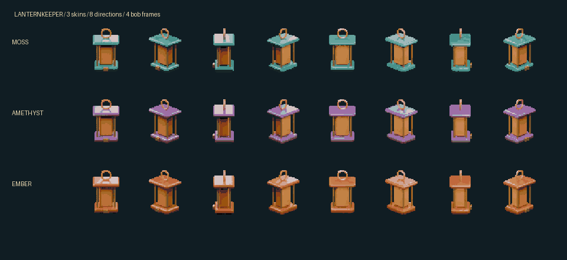

# Local Asset Studio

**A local-first creative workflow studio for generative images, video, 3D, references, model research, and reproducible experiments.**

Local Asset Studio sits above ComfyUI and a set of isolated model environments. It is designed to make powerful local creative pipelines understandable without hiding what they do: choose a creative goal, add references, inspect the planned route, generate deliberately, review the evidence, and keep the result together with the settings that produced it.

On the configured Windows PC, double-click the **Asset Studio** desktop shortcut. Pick a recipe or preset, describe the result, add references when needed, and press **Generate**. Advanced ComfyUI remains available for node-level work, but learning its graph editor is not a prerequisite for the guided Studio paths.



[Start here](docs/START-HERE.md) ·
[Product direction](docs/PRODUCT_DIRECTION.md) ·
[Status by goal](docs/STATUS.md) ·
[Workflow Lab](docs/WORKFLOW-LAB.md) ·
[Anime & fantasy atelier](docs/ANIME-FANTASY-ATELIER.md) ·
[Documentation index](docs/README.md)

## What the Studio is becoming

The repository began as a friendly launcher and preset catalogue. It is now developing into a governed local creative operating layer with five connected surfaces:

1. **Create and continue** — goal-led recipes for images, animation, edits, 3D drafts, refinement, and native finishing.
2. **Reference Atelier** — assign identity, pose, style, outfit, composition, or source roles to one or more images and inspect how a route will use them.
3. **Workflow Studio** — build, compare, and eventually pilot ComfyUI workflows from a clearer interface while keeping the underlying graph and controls visible.
4. **Experiments and qualification** — run bounded comparisons, record source/model/node compatibility, retain uncertain outcomes, and promote routes only when their evidence supports the claim.
5. **Workspace and export** — collect, tag, compare, restore, refine, and hand accepted assets to Krita, Godot, Blender, or another explicit destination.

The long-term goal is not a black-box “make art” button. It is a studio in which a person or an authorized agent can understand the inputs, route, environment, model/LoRA terms, resource cost, output identity, and evidence state of every consequential operation.

## What works today

### Guided creation

- goal-led recipes and presets for pixel concepts, abstract art, realistic imagery, anime/fantasy characters, manga studies, refinement, reference edits, short animation, and 3D drafts;
- a simpler local browser interface backed by a Python standard-library server;
- prompt recipes, wildcard expansion, settings knowledge, LoRA slots, parameter controls, seed reuse, and saved output metadata;
- explicit model-environment switching for isolated routes such as HiDream O1 and MiniMax H3;
- local job submission, progress, output validation, bounded receipts, and an explicit local disposition for an uncertain job (which records the outcome as unknown and does not cancel remote work; cancellation itself exists only for AV/Production operations).

### Reference work

- single and multiple image references with declared roles;
- identity, pose, style, composition, and editing routes where the underlying architecture supports them;
- Qwen Atelier and Combine-style workbenches for separating reference intent instead of treating every image as an undifferentiated prompt;
- pose skeleton and depth control routes with recorded execution evidence;
- gentle variation, targeted edits, masked repair, and controlled continuation paths.

Reference fidelity remains model- and route-dependent. A completed job proves execution, not that identity, anatomy, pose, costume, or artistic intent was accepted. Complex foreshortening, unusual contact poses, occlusion, multi-character interaction, and exact pose transfer remain active qualification areas rather than solved product promises.

### Experiment and evidence workflows

- bounded settings grids and LoRA-weight comparisons;
- curated run records and reusable scorecard templates;
- route/model/source compatibility notes with `verified`, `unverified`, `blocked`, and uncertainty-aware states;
- output hashes, prompt IDs, submitted chains, timings, and reviewer notes for selected qualified routes;
- benchmark and profiling seams that preserve failed, partial, and inconclusive trials instead of reporting only winners.

### Workspace and native finishing

- collect, tag, favorite, compare, restore, and continue from generated outputs;
- create finishing plans rather than silently altering accepted assets;
- export selected images to Krita and a tested Godot sprite-project path;
- Blender-authored assets, textured GLBs, sprite packing, and playable Lanternkeeper examples;
- local asset gallery and model samples for informed route selection.

## Model and route portfolio

The Studio uses a role-based portfolio rather than pretending one model is best at everything.

| Creative goal | Current starting point | Typical next step |
| --- | --- | --- |
| Pixel item concepts | SDXL + Pixel Art XL LoRA | compare strength with the same seed |
| Realistic promotional art | RealVisXL | evaluate FLUX Klein or Z-Image routes |
| Abstract website art | SDXL abstract recipes | vary composition and colour vocabulary |
| Anime/fantasy characters | WAI or Animagine | Pony, Krea 2, pose/depth controls, refinement |
| Manga/anime studies | LineAni or Anima Aesthetic | screentone, cinematic lighting, style studies |
| Multi-reference composition | Qwen Atelier / qualified Combine routes | separate identity, pose, style, outfit, and scene roles |
| Scoped reference editing | FLUX Klein edit or Qwen edit | mask/repair, gentle variation, compare retained traits |
| Native high-resolution concepts | isolated HiDream O1 | restyle, compare seeds, refine |
| Short image animation | Wan 2.2 or isolated MiniMax H3 | audition motion before longer shots |
| Textured 3D draft | TRELLIS | authored Blender parts, pivots, motion, and QA |
| Exact repeated views/motion | Blender-authored pipeline | render, reduce palette, pack atlas |

Read [models/README.md](models/README.md) before using a checkpoint or LoRA commercially. Matching hashes help with reproducibility; they do not authenticate a publisher or create usage rights. NoobAI is retained for hobby experiments under its author terms. WAI mirror provenance and every stacked LoRA’s individual terms remain separate clearance questions.

Local graphs do not call hosted moderation services. Local execution, capability, content policy, and licence suitability are distinct questions.

## Operating principles

### Local first, explicit authority

The Studio should never treat discovery as permission. Research can identify a model, node, workflow, or source; it cannot silently download, install, execute, generate, train, publish, or change an environment. Consequential actions need an explicit operator or reviewed agent capability.

### Evidence before promotion

A route moves from candidate to qualified only through the relevant checks: source/provenance, environment compatibility, graph validation, bounded execution, output integrity, visual review, resource behavior, and licence/terms notes. “Ran successfully” and “produced the desired art” are different states.

### Reproducible, not frozen

Jobs should retain enough information to repeat or explain them: route, environment, graph/input mapping, model and adapter identities, prompts/settings, references, seed, timing, output hashes, and review notes. The Studio can evolve without erasing how an earlier result was made.

### Legible power

Advanced controls should be available through progressive disclosure. A beginner starts from a goal and recipe; an experienced user can inspect or modify the node-level workflow, build reusable graphs, and run headlessly without maintaining a second undocumented system.

## Direction

### Now: reliable reference composition

- consolidate identity/pose/style/outfit/composition roles into one inspectable reference plan;
- make ambiguity visible and ask only the questions that materially affect the route;
- qualify pose skeleton, depth, segmentation, dense correspondence, edit, and hybrid routes against difficult pose families;
- keep character, costume, style, and scene consistency scored separately;
- add repair/retry strategies that know whether a failure is geometry, identity, anatomy, conditioning conflict, or finishing quality.

### Next: Workflow Studio and headless parity

- represent workflows as versioned, inspectable Studio documents;
- expose available ComfyUI nodes, ports, controls, validation, preview, and connections through the Studio interface;
- preserve the original graph and generated API graph relationship;
- make every safe UI workflow addressable through a bounded headless/agent contract;
- keep install, environment mutation, model acquisition, and execution as separate capabilities.

### Next: route and model intelligence

- maintain immutable source snapshots and reviewed compatibility records;
- compare exact model versions, prompt grammars, schedulers, resolutions, controls, adapters, and VRAM/runtime behavior;
- build a small role-based qualified portfolio instead of an uncurated model warehouse;
- retain failed and inconclusive trials so future agents do not repeat the same dead ends.

### Later: a complete local asset pipeline

- stronger character sheets and multi-view consistency;
- deliberate two-character interaction and unusual-pose workflows;
- scoped costume/anatomy editing with accepted-region protection;
- animation continuation and in-between planning;
- audio/voice and Blender automation under the same evidence model;
- project-ready asset packs with provenance, QA, native-tool handoff, and reversible refinement histories.

The detailed priorities, non-goals, and promotion gates live in [docs/PRODUCT_DIRECTION.md](docs/PRODUCT_DIRECTION.md) and the [strategy bundle](docs/strategy/README.md).

## Run and develop

On the configured Windows PC, use `Start Studio.cmd` or the desktop shortcut.

- Studio: `http://127.0.0.1:8191`
- Advanced ComfyUI: `http://127.0.0.1:8188`

On another computer, copy `config/example.json` to `config/local.json`, point it to installed Python and ComfyUI runtimes, and install required nodes/models separately. The repository is **not** a complete fresh-machine installer.

```console
python app/server.py
python -m unittest discover -s tests
python scripts/validate-repo.py
```

Python 3.12+ is required. Pillow supports validation/finishing and psutil supports explicit environment switches. See [operations](docs/OPERATIONS.md) for backup, troubleshooting, environment setup, and adding presets.

## Repository map

| Path | Purpose |
| --- | --- |
| `app/` | local Studio UI and Python server; local viewer bundle; no frontend build toolchain |
| `presets/` | recipe catalogue, controls, settings knowledge, wildcards, and graph-input mappings |
| `workflows/api/` | executable API graphs used by Studio routes |
| `workflows/comfyui/` | matching visual graphs for inspection and deeper changes |
| `scripts/` | launch, generate, validate, benchmark, profile, finish, and export tooling |
| `experiments/curated/` | selected evidence, findings, and scorecards |
| `experiments/runs/` | local recipes/results; intentionally ignored by Git |
| `examples/` | Lanternkeeper, gallery, references, native exports, and learning artifacts |
| `models/` | checksums, provenance, compatibility notes, and candidates; no weights |
| `docs/` | product, workflow, model, operations, research, and strategy documentation |

## Documentation paths

- [First image walkthrough](docs/START-HERE.md)
- [Workspace](docs/WORKSPACE.md)
- [Reference Atelier](docs/REFERENCE-ATELIER.md)
- [Experiments and native finishing](docs/EXPERIMENTS.md)
- [Workflow Lab](docs/WORKFLOW-LAB.md)
- [Anime & fantasy atelier](docs/ANIME-FANTASY-ATELIER.md)
- [Anime quality and anatomy](docs/ANIME-QUALITY.md)
- [Anime detailing](docs/ANIME-DETAILING.md)
- [HiDream O1](docs/HIDREAM.md)
- [MiniMax H3 on Windows](docs/H3-WINDOWS.md)
- [Native exports](docs/NATIVE-EXPORTS.md)
- [Current state](CURRENT_STATE.md)
- [Owner choices](HUMAN_TODO.md)

## Status and limitations

This is an actively developed personal/local studio, not a hosted generation service. The configured AMD Radeon workflow, installed nodes, isolated environments, model files, and measured timings are machine-specific evidence—not universal performance claims. Several routes are verified only for bounded executions; artistic acceptance and commercial clearance remain separate.

The project intentionally keeps uncertainty visible. Candidate research, planned Workflow Studio features, adult-illustration discovery contracts, source registries, pose experiments, and low-level optimisation work do not become shipped capability merely because an issue, document, or draft PR exists.
