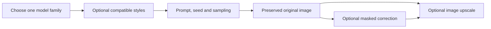

# Modular illustration baselines

This catalog supplies five non-sexual illustration starting points: three SDXL checkpoints and two Anima-family routes. Offline checks cover bindings, preparation and adapter pruning; `verified: true` is used only for the Anima preset after the bounded inspected execution recorded in [ANIMA-BASELINE-EXECUTION-2026-09-13.md](ANIMA-BASELINE-EXECUTION-2026-09-13.md). A listed resource pin identifies the expected file, while a completed download receipt proves the local file matches it. Neither is art acceptance.

## Executed boundary — 13 September 2026

The Anima v1 graph is valid against the live ComfyUI schema and five saved Workflow Studio
documents exist for the baseline routes. The Anima document compiled successfully. The four
other checkpoint documents (CSTati v3, YumeFlux ILv1, AniFox v2 and JANIMA v1) remain uncompiled
because their checkpoint or diffusion-model files are not downloaded locally. Six of the ten new
resource files have verified receipts; source pins, local installation and licence terms remain
separate facts.

The actual saved-document walkthrough is: **Guided workflows → Workflow builder → Refresh saved →
choose Baseline - Anima v1 → Open current → Load / refresh installed nodes → Steps view**. Wait
until the node catalog reports its loaded classes; otherwise the saved controls show as unavailable.
Individual style Steps are disabled in
the base document, which already supplies their explicit typed bypasses for compilation. To reproduce the executed
first-style case, set the first style strength to `1.0` and enable only that style; all other style
slots stay disabled. The base case keeps every style disabled. Registered-preset generation remains
the supported execution path; an arbitrary edited graph is currently export-only.

The owner's selected B setup is also saved separately as **Anima - B softer cinematic shading**,
Workspace document `b4b8770a-c8d9-5055-b031-c08ce0b37762`, revision 3. It enables only the first
style at strength 1.0. Its compiled graph has the same node inputs and connections as executed B;
the original base document remains at revision 1. The browser walkthrough verified navigation,
opening the base document, loading 1,224 installed node classes, rendering Steps, checking the
base connections and saving a separate copy. Initial automated input fills did not reach the
saved copy, and confirmation handling timed out. The revision-checked SDK set B's exact values.
A fresh Chrome tab then reopened B at revision 3, displayed the correct model, first style at
strength 1.0, seed and sampling controls, and passed Check connections. A real keyboard edit
changed strength to 1.25; leaving the field committed the edit, and Undo restored 1.0. Leave a
field with Tab before checking or saving. No generation was submitted by this walkthrough.

## Where resources belong

The model root on this PC is `C:/AI/ComfyUI_windows_portable/ComfyUI/models/`. Studio's `models/library.json` records the ten new exact source versions, byte sizes and full SHA-256 values. Downloads use temporary `.part` files and are renamed only after their size and hash match. In-progress files are not usable model installations. Six of the ten new files currently have verified receipts; the four checkpoint/diffusion-model downloads above remain missing.

| Folder | Resources | Why |
| --- | --- | --- |
| `checkpoints/` | CSTati version 3160406; YumeFlux version 3135837; AniFox version 3081757 | Full Illustrious/SDXL checkpoints, loaded with their encoder and VAE through `CheckpointLoaderSimple`. |
| `diffusion_models/` | JANIMA version 2967640, file 2847103 | Split Anima diffusion weights, loaded through `UNETLoader`; it uses the existing separate text encoder and VAE. |
| `loras/` | Style adapters 3225971 (Anima) and 3184370 (Illustrious); aesthetic boost 2855073; Rapscallion 3056000; BunnySlop 3174127; BunnyMid 3197565 | Architecture-specific adapters. The similarly named Anima and Illustrious files are not interchangeable. |

Source listing URLs are retained beside every pin. Current API responses do not provide creator licence/commercial-use permission fields for these additions, so those remain unverified. Files and download receipts stay outside Git's source artifacts; installing them does not upgrade ComfyUI or Python.

## Control held constant

Every base recipe uses batch size 1, 832×1216 and seed `2026091301`. The character is an adult original character in a tailored travelling coat, high-neck shirt, trousers and leather boots; it has no erotic framing or prompt language. Keep that control fixed while comparing a checkpoint or one adapter strength.

| Preset | Fixed loader file | Sampler controls | Adapter state |
| --- | --- | --- | --- |
| CSTati v3 | `cstatiANIMEV30XL_v30.safetensors` | 30 steps, CFG 4, Euler ancestral, Karras | `nsfw_girls.safetensors` slot 1 = 0; `noirpopwave.safetensors` slot 2 = 0 |
| YumeFlux ILv1 | `yumefluxXLIllustrious_ilV10.safetensors` | 30 steps, CFG 4, Euler ancestral, Karras | same two slots, both 0 |
| AniFox v2 | `anifoxXLV20_anifoxV2.safetensors` | 30 steps, CFG 5, Euler ancestral, Karras | same two slots, both 0 |
| Anima v1 | `anima-base-v1.0.safetensors` | 30 steps, CFG 4.5, Euler, simple | six model-only slots all 0; slot 1 is `nsfw_girls_anima.safetensors` |
| JANIMA v1 | `JANIMAAnima_v10_2847103.safetensors` | 30 steps, CFG 4.5, Euler, simple | five model-only slots all 0 |

The three SDXL graphs clone the known two-`LoraLoader` WAI shape, but each checkpoint filename is fixed in its own graph. Their base recipes keep both slots at zero; the separate first-adapter audition recipes set only slot 1 to 1.0 and retain Noir slot 2 at zero. A zero strength is meaningful: Studio prunes the disabled LoRA node and reconnects its model/CLIP inputs, so it is not a loaded-at-zero inference setting.

The Anima v1 graph retains the established six `LoraLoaderModelOnly` chain so optional slots behave like the existing Anima artist-stack family. Its baseline recipe disables every slot. The retained slots 2–6 point at the existing artist-stack filenames but do not participate in the baseline.

JANIMA uses `UNETLoader`: its intended location is `diffusion_models/JANIMAAnima_v10_2847103.safetensors`, despite a source-site type label that might call it a checkpoint. It deliberately reuses the actual existing Anima graph companion names `qwen_3_06b_base.safetensors` and `qwen_image_vae.safetensors`; no filename was guessed from a marketing name.

JANIMA's five slots are, in order: `anima-highres-aesthetic-boost.safetensors`, `rapscallion_cherrypick_min1024_prodigy_lr1_4000_stylepush.safetensors`, `BunnySlop_Ani_v5.56.safetensors`, `BunnyMid_Ani_v1.safetensors`, and `nsfw_girls_anima.safetensors`. The first four include the prompt triggers `@rapscallion_style`, `@sl0p`, and `@m1d` where applicable. `BunnySlop_Ani_v5.56.safetensors` is intentionally distinct from the older retained BunnySlop version.

## Deliberate stack and assumptions

`janima-v1-authored-five-adapter-stack` is the only new recipe that enables a JANIMA adapter chain. Its weights are 0.3, 0.6, 0.35, 0.25 and 0.5 in slot order. They are cautious authored starting values, explicitly editable and **not** a source/screenshot transcription. The generic Anima screenshot settings support the 30-step, CFG 4.5, Euler/simple starting point and the optional comparison uses CFG 5.5 with Euler ancestral/simple; neither establishes that JANIMA has the same optimum.

## Component ladder

Use one layer at a time:

`anima-v1-first-adapter-comparison` is the one-variable Anima audition: it enables only slot 1 while keeping the baseline's CFG, sampler and scheduler. The separate `anima-v1-screenshot-sampling-comparison` keeps the same prompt and seed but uses the supplied CFG 5.5 and Euler ancestral settings, so it tests multiple settings together.

1. Generate an unmodified base recipe.
2. Change only one style adapter or its strength at the fixed seed.
3. For SDXL pose guidance, start with **WAI — pose guide** (`wai-pose`). Its current checkpoint is WAI. Replacing that loader with another Illustrious checkpoint is an editable experiment, not a recorded run. Anima needs its own compatible conditioning route; never connect an SDXL ControlNet directly to it.
4. For a local image correction, **Anime Masked Repair (manual alpha)** (`anime-masked-repair`) or **WAI — Fooocus inpaint repair** (`sdxl-inpaint-fix`) provides an existing SDXL route. Follow that preset's reference/mask instructions. Passing an Anima result as an image to a correction stage does not turn the SDXL model into Anima: inspect the repaired region for style drift and preserve the original.
5. For enlargement, **Anime upscale — ESRGAN 2x** (`anime-esrgan`) works at the image stage. **Anime Refine 1.5x** (`anime-refine`) adds a diffusion refinement stage and can change details, so treat it as a separate result. Select a candidate before spending that extra computation.

In Workflow Studio, open **Guided workflows → Workflow builder**, choose **Start from a recipe**, import the registered API graph, select outputs and **Check connections**, then use **Export checked API graph**. This exports the checked API format. PR #130 supplies [shared document revisions and agent commands](workflow-studio/SHARED-DOCUMENTS.md), and PR #131 adds [named Steps and revision-safe saving](workflow-studio/STEPS-AND-SAVING.md). Use **Create named step** to group existing nodes and expose their controls, then switch between **Steps view** and **Nodes view** over the same document. Disabling a producer still needs an explicit compatible bypass; no replacement connection is guessed. Arbitrary edited graphs remain export-only pending #122, and reusable module libraries with typed external interfaces remain work in #120/#121. The existing registered-preset route remains the supported generation path.

## What remains before broader execution

Exact source pins are recorded; six of ten new resource files have verified receipts and the four other checkpoint/diffusion-model downloads remain pending. The selected Anima preset has been inspected against the live node schema and executed only at the bounded base and first-style controls recorded in [the execution note](ANIMA-BASELINE-EXECUTION-2026-09-13.md). A successful generation establishes only that exact graph/control combination. A useful reliability study next holds the graph and prompt fixed across several seeds and logs completion, runtime failures and visual defects separately. The two earlier lanternkeeper demonstrations remain experiments at the owner's request.
