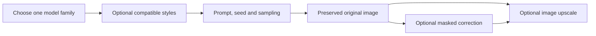

# Modular illustration baselines

This catalog supplies five non-sexual illustration starting points: three SDXL checkpoints and two Anima-family routes. Offline checks cover bindings, preparation and adapter pruning; `verified: false` remains until an inspected generation is recorded. A listed resource pin identifies the expected file, while a completed download receipt proves the local file matches it. Neither is art acceptance.

## Where resources belong

The model root on this PC is `C:/AI/ComfyUI_windows_portable/ComfyUI/models/`. Studio's `models/library.json` records the ten new exact source versions, byte sizes and full SHA-256 values. Downloads use temporary `.part` files and are renamed only after their size and hash match. In-progress files are not usable model installations.

| Folder | Resources | Why |
| --- | --- | --- |
| `checkpoints/` | CSTati version3160406; YumeFlux3135837; AniFox3081757 | Full Illustrious/SDXL checkpoints, loaded with their encoder and VAE through `CheckpointLoaderSimple`. |
| `diffusion_models/` | JANIMA2967640, file2847103 | Split Anima diffusion weights, loaded through `UNETLoader`; it uses the existing separate text encoder and VAE. |
| `loras/` | Style adapters3225971(Anima) and3184370(Illustrious); aesthetic boost2855073; Rapscallion3056000; BunnySlop3174127; BunnyMid3197565 | Architecture-specific adapters. The similarly named Anima and Illustrious files are not interchangeable. |

Source listing URLs are retained beside every pin. Current API responses do not provide creator licence/commercial-use permission fields for these additions, so those remain unverified. Files and download receipts stay outside Git's source artifacts; installing them does not upgrade ComfyUI or Python.

## Control held constant

Every base recipe uses batch size 1, 832×1216 and seed `2026091301`. The character is an adult original character in a tailored travelling coat, high-neck shirt, trousers and leather boots; it has no erotic framing or prompt language. Keep that control fixed while comparing a checkpoint or one adapter strength.

| Preset | Fixed loader file | Sampler controls | Adapter state |
| --- | --- | --- | --- |
| CSTati v3 | `cstatiANIMEV30XL_v30.safetensors` | 30 steps, CFG 4, Euler ancestral, Karras | `nsfw_girls.safetensors` slot 1 = 0; `noirpopwave.safetensors` slot 2 = 0 |
| YumeFlux ILv1 | `yumefluxXLIllustrious_ilV10.safetensors` | 30 steps, CFG 4, Euler ancestral, Karras | same two slots, both 0 |
| AniFox v2 | `anifoxXLV20_anifoxV2.safetensors` | 30 steps, CFG 5, Euler ancestral, Karras | same two slots, both 0 |
| Anima v1 | `anima-base-v1.0.safetensors` | 30 steps, CFG 4.5, Euler, simple | six model-only slots all 0; slot 1 is `nsfw_girls_anima.safetensors` |
| JANIMA v1 | `JANIMAAnima_v10_2847103.safetensors` | 30 steps, CFG 4.5, Euler, simple | five model-only slots all 0 |

The three SDXL graphs clone the known two-`LoraLoader` WAI shape, but each checkpoint filename is fixed in its own graph. Their base recipes keep both slots at zero; the separate first-adapter audition recipes set only slot 1 to 1.0 and retain Noir slot 2 at zero. A zero strength is meaningful: Studio prunes the disabled LoRA node and reconnects its model/CLIP inputs, so it is not a loaded-at-zero inference setting.

The Anima v1 graph retains the established six `LoraLoaderModelOnly` chain so optional slots behave like the existing Anima artist-stack family. Its baseline recipe disables every slot. The retained slots 2–6 point at the existing artist-stack filenames but do not participate in the baseline.

JANIMA uses `UNETLoader`: its intended location is `diffusion_models/JANIMAAnima_v10_2847103.safetensors`, despite a source-site type label that might call it a checkpoint. It deliberately reuses the actual existing Anima graph companion names `qwen_3_06b_base.safetensors` and `qwen_image_vae.safetensors`; no filename was guessed from a marketing name.

JANIMA's five slots are, in order: `anima-highres-aesthetic-boost.safetensors`, `rapscallion_cherrypick_min1024_prodigy_lr1_4000_stylepush.safetensors`, `BunnySlop_Ani_v5.56.safetensors`, `BunnyMid_Ani_v1.safetensors`, and `nsfw_girls_anima.safetensors`. The first four include the prompt triggers `@rapscallion_style`, `@sl0p`, and `@m1d` where applicable. `BunnySlop_Ani_v5.56.safetensors` is intentionally distinct from the older retained BunnySlop version.

## Deliberate stack and assumptions

`janima-v1-authored-five-adapter-stack` is the only new recipe that enables a JANIMA adapter chain. Its weights are 0.3, 0.6, 0.35, 0.25 and 0.5 in slot order. They are cautious authored starting values, explicitly editable and **not** a source/screenshot transcription. The generic Anima screenshot settings support the 30-step, CFG 4.5, Euler/simple starting point and the optional comparison uses CFG 5.5 with Euler ancestral/simple; neither establishes that JANIMA has the same optimum.

## Component ladder

Use one layer at a time:

1. Generate an unmodified base recipe.
2. Change only one style adapter or its strength at the fixed seed.
3. For SDXL pose guidance, start with **WAI — pose guide** (`wai-pose`). Its current checkpoint is WAI. Replacing that loader with another Illustrious checkpoint is an editable experiment, not a recorded run. Anima needs its own compatible conditioning route; never connect an SDXL ControlNet directly to it.
4. For a local image correction, **Anime Masked Repair (manual alpha)** (`anime-masked-repair`) or **WAI — Fooocus inpaint repair** (`sdxl-inpaint-fix`) provides an existing SDXL route. Follow that preset's reference/mask instructions. Passing an Anima result as an image to a correction stage does not turn the SDXL model into Anima: inspect the repaired region for style drift and preserve the original.
5. For enlargement, **Anime upscale — ESRGAN 2x** (`anime-esrgan`) works at the image stage. **Anime Refine 1.5x** (`anime-refine`) adds a diffusion refinement stage and can change details, so treat it as a separate result. Select a candidate before spending that extra computation.

This is a comparison plan, not a modular Step implementation. In the current PR #126 Workflow Studio path, open **Guided workflows → Workflow builder**, choose **Start from a recipe**, import the registered API graph, select outputs and **Check connections**, then use **Export checked API graph**. It is a checked API export, not a ComfyUI visual workflow file and not permission to execute a changed graph. Arbitrary edited graphs are export-only pending #122; shared document commands and reusable Step modules remain unimplemented work in #120. Do not add a second editor, raw `/prompt` executor or another queue to bridge those gaps.

## What remains before execution

Exact source pins are recorded; downloads are being verified individually. Wait until the selected model files are complete, then inspect the preset against the live node schema. A successful generation establishes only that exact graph/control combination. A useful reliability study next holds the graph and prompt fixed across several seeds and logs completion, runtime failures and visual defects separately. The two earlier lanternkeeper demonstrations remain experiments at the owner's request.
