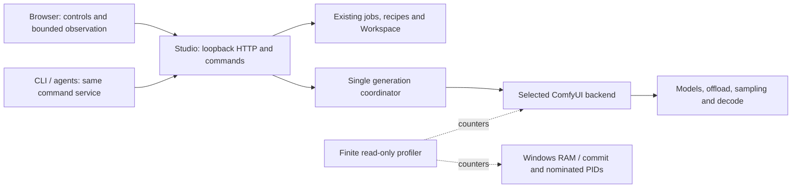

# Resource efficiency strategy

13 September 2026. Programme: [#172](https://github.com/Chris0Jeky/local-asset-studio/issues/172).
This is a staged engineering plan. Implementation, observed performance and generation
feasibility are recorded separately below.

## What we are optimising

The goal is to keep Studio inexpensive to leave open while giving generation predictable
access to the machine. Four measurements answer different questions:

| Measurement | What it tells us | What it does not tell us |
| --- | --- | --- |
| Physical RAM available | How much resident memory Windows can provide now | How much additional committed memory Windows can promise |
| Windows commit headroom | Commit limit minus committed bytes; relevant to large host allocations | Free VRAM or guaranteed contiguous allocation capacity |
| Process working set / private bytes | Resident pages / private committed allocation where available | Working sets cannot be summed as total RAM; shared pages overlap |
| ComfyUI device and Torch VRAM counters | Device availability and allocator state reported by that runtime | Browser-specific GPU usage, stage peaks between samples, or proven feasibility |

Offloading trades GPU residency against RAM, commit, transfer bandwidth and sometimes disk I/O.
A lower VRAM figure can accompany higher RAM consumption and slower generation. Increasing
the Windows page file does not add physical RAM or fix a decoder that requests too much VRAM.
The existing commit gate remains part of submission admission.

## Architecture and ownership



The browser may close without owning or stopping a generation. Studio owns jobs and retained
prompt IDs; ComfyUI owns model tensors and execution caches. Existing Workspace and workflow
commands own persistent documents and assets. A future sync layer observes those owners.
It must not become a second executor or authoritative copy of job state.

Baseline source map, initially inspected at Studio `cb438b4`:

- `app/server.py`: single worker, retained submission/history, full jobs endpoint, readiness
  projection, node-schema cache and fresh pre-submit commit gate.
- `app/backends.py` and `app/runtime_recovery.py`: explicit selected backend, identity/queue
  interlocks, bounded recovery and no blind replay of uncertain prompts.
- `app/static/app.js`: four-second job polling and fifteen-second health polling. Jobs are
  repeatedly serialised, but `renderJobs()` **already skips unchanged DOM updates**.
- `app/static/workspace.js`: full Workspace read with an existing signature guard and in-flight
  flag. Preserve both, plus trash/reference/selection semantics.
- `app/static/studio-workbench.js`: additional twelve-second overview reads of Workspace,
  Production and jobs; it already skips hidden overview ticks.
- `app/static/av.js` / `voice.js`: independent active-render observers; later migration needs
  their own editing, media and recovery checks.
- `app/model_library.py`: model inventory and install receipts. Disk discovery is separate
  from runtime liveness and should not be rebuilt merely to show a connection indicator.

The other active task owns the shared runtime, Wan decode capacity and primary integration.
This programme uses isolated worktrees. It does not restart shared services, change their
configuration, touch model packages, or submit comparative generations during the first wave.

## Implementation sequence

| Slice | Concrete outcome and proving check | Tracking |
| --- | --- | --- |
| Resource baseline | Finite counter sampler, bounded GET, no Torch import, preserved receipts and unavailable states | [#173](https://github.com/Chris0Jeky/local-asset-studio/issues/173) |
| Browser scheduling | One periodic read per lane, hidden-page pause, activity/view cadence, bounded timers and visible resumption | [#174](https://github.com/Chris0Jeky/local-asset-studio/issues/174) |
| Server observation sync | Small status projections and conditional GET first; bounded event invalidations only if worthwhile | [#175](https://github.com/Chris0Jeky/local-asset-studio/issues/175) |
| Runtime profiles | Inspect supported arguments, compare headless/preview/cache/offload policies, then expose proven options | [#176](https://github.com/Chris0Jeky/local-asset-studio/issues/176) |
| Media and history limits | Bounded pages/DOM, derived thumbnails, explicit heavy previews, preserved originals and selections | [#177](https://github.com/Chris0Jeky/local-asset-studio/issues/177) |
| Resource admission | Stage-aware feasibility and auxiliary-work budgets through the existing coordinator | [#178](https://github.com/Chris0Jeky/local-asset-studio/issues/178) |

These are dependent increments, not a rewrite. Existing owners remain:
[#77](https://github.com/Chris0Jeky/local-asset-studio/issues/77) and
[#89](https://github.com/Chris0Jeky/local-asset-studio/issues/89) for host/native failures;
[#106](https://github.com/Chris0Jeky/local-asset-studio/issues/106) for commit admission;
[#163](https://github.com/Chris0Jeky/local-asset-studio/issues/163) for Wan capacity;
[#93](https://github.com/Chris0Jeky/local-asset-studio/issues/93),
[#94](https://github.com/Chris0Jeky/local-asset-studio/issues/94),
[#95](https://github.com/Chris0Jeky/local-asset-studio/issues/95) and
[#110](https://github.com/Chris0Jeky/local-asset-studio/issues/110) for recovery correctness.
Document revision commands stay with #120; execution stays with #22/#122.

## The sync design

Start with the cheaper mechanism: completion-based polling, visibility suspension and
explicit refresh. The main page should not build a backlog when a local HTTP read is slow.
Pause observation, never execution, when the page is hidden. On return, refresh the current
state once; do not replay every missed tick. Generation POSTs remain outside read scheduling.

Next split liveness/progress from expensive schema, inventory and full history. Conditional
GET can avoid unchanged payloads, but computing an ETag by rebuilding the entire response
on every call would retain the server cost. Tie projections to relevant source revisions and
runtime identity; coalesce concurrent builds. No cached liveness result authorises submission.

If measurements justify push, one Studio-owned ComfyUI connection should receive small
progress/invalidation hints. Browser subscriptions use a bounded buffer with epoch/sequence
IDs. A gap, restart or slow subscriber forces a fresh snapshot. Reconnect reconciles known
prompt IDs against durable jobs/history. An event alone is not completion authority.

ComfyUI provides status, execution and progress messages over its WebSocket.
Some messages carry node outputs, so they need an allow-listed projection.
[Official message contract](https://docs.comfy.org/development/comfyui-server/comms_messages).
Binary latent previews stay off the status path. Do not create one Comfy connection per
browser or keep an unbounded replay log. Measure long-lived HTTP thread cost before choosing
SSE, WebSocket or long-poll over conditional polling. Cross-tab leadership is a later option,
only if duplicate visible tabs remain a measured cost.

## Running with less UI work

The existing launcher supports:

```powershell
.\scripts\Start-Studio.ps1 -NoBrowser
```

This starts or reuses the configured services without opening a browser. It is **not** a
model-memory mode and may start a runtime, so coordinate with any task already running it.
Normal CLI/agent workflow commands use the same Studio service; the runtime does not need
a native Comfy graph editor open to execute an authorised job.

ComfyUI's official guidance describes disabling previews and choosing cache/offload modes.
Those settings trade memory for work or transfer cost; they are not interchangeable fixes.
[Official performance guidance](https://docs.comfy.org/troubleshooting/overview).

Read-only inspection found these options in installed ComfyUI revision
`40c4fcdf513a4523e39d54a9d391908af8df8171`; the live endpoint reported
ComfyUI 0.35.0 and Torch 2.9.1+rocm7.2.1:

| Option | Installed-source meaning | Decision |
| --- | --- | --- |
| `--preview-method none` | Disable latent sampler previews; CLI default is no previews, Studio primary currently selects latent2rgb | First candidate for an explicit generation-focused profile; no live switch in this wave |
| `--cache-ram` | Active and inactive **headroom thresholds**, not a hard allocation cap; default pressure cache | Keep current defaults until a matched comparison |
| `--cache-none` | Retain fewer node results but execute every node again | Diagnostic alternative; may increase latency |
| `--cache-lru` | Limit retained result count; one result can still be large | Count is not a byte budget |
| `--disable-smart-memory` | Aggressively offload to ordinary RAM | Do not treat as a general solution for this RAM-constrained machine |
| `--async-offload` / pinned-memory controls | Transfer/concurrency policies with platform-dependent cost | Inspect actual AMD path and benchmark one change at a time |
| `--fast-disk` / DynamicVRAM | Disk-backed dynamic-loading path and runtime support gates | Do not enable from a documentation claim alone |

The installed normal AMD DynamicVRAM gate in `main.py` requires ROCm >=7.14. The observed
ROCm 7.2.x runtime does not meet that gate. An override exists, but this programme does not
bypass it or upgrade packages to obtain a feature. Current public DynamicVRAM descriptions
are useful design context, not evidence that it is active on this machine.
[Comfy's design description](https://blog.comfy.org/p/dynamic-vram-in-comfyui-saving-local).

A single validated launch-policy representation should eventually cover managed recovery
and launcher paths, disclose effective arguments and reject unsupported combinations.
Changing profiles must remain an explicit idle-boundary operation, with rollback to the
recorded prior arguments. Never silently change resolution, frames, seed or quality.

## Reproducible measurement

Implemented first: `scripts/profile-resources.py`, supported by `app/resource_probe.py`.
It samples host physical memory and Windows commit; optional explicitly nominated PIDs;
and optionally the configured loopback runtime's `GET /system_stats`. It does not discover
or control processes, enumerate their command lines, query jobs, load models or start Studio.

From the repository root, a host-only baseline:

```powershell
python scripts/profile-resources.py --include-self --samples 6 --interval 5
```

With an already-running ComfyUI:

```powershell
python scripts/profile-resources.py --include-self --comfy-url http://127.0.0.1:8188 --samples 6 --interval 5 --output .runtime/resource-runtime-baseline.jsonl
```

Use `--pid` repeatedly with currently verified process IDs to observe Studio, ComfyUI or
browser processes. IDs are counter labels, never process-ownership authority. A nominated
PID is pinned to its initial creation time; identity changes do not rebind the observer.
Missing or inaccessible observations are null with a reason. Browser subprocess selection
requires separate verification; a device VRAM total is not browser attribution.

The command accepts 1–120 samples, 1–60 seconds after each completed sample and at most
16 PIDs including `--include-self`. It has one request at a time, a 1 MiB response limit,
two-second socket waits and an elapsed deadline checked between body reads. Header parsing
and a final blocking read may exceed the target deadline; actual elapsed time is recorded.
There is no proxy or redirect handling. Only numeric device counters and bounded version
strings are retained. Each line is flushed, interrupted receipts survive, and existing
files are never overwritten. Treat command completion as receipt creation: an offline
runtime is represented inside that receipt, not certified healthy by exit status zero.

`peak_working_set_bytes`, where present, is the **process-lifetime** peak, not a measured
peak within this observation window. CPU percentage is one-core based and may exceed 100%.
Sampled values can miss transient allocations. The sampler records its own source hash.
For a comparison, also retain Git/build identity, exact workflow/input/model identities,
start/end conditions, counter availability and the raw local receipt.

A controlled benchmark has two parts:

1. **UI fixture:** same synthetic history/assets and viewport; compare visible idle, active,
   hidden and slow/offline server conditions. Measure request count, maximum concurrency,
   bytes, DOM/media count, CPU and retained heap. Separately test response-loss and mutation
   correctness; reduced traffic is not enough.
2. **Generation:** the runtime owner chooses a finite authorised budget, one representative
   workflow and one variable. Record cold and warm execution, encode/sample/decode/export
   outcomes, peak observations, offload/disk activity and failures. Preserve uncertain IDs.
   Stop on OOM/native failure; do not silently retry or mix changes.

The first wave does not spend a generation budget. The concurrent Wan capacity probe and
its acceptance remain with #163; this strategy does not claim its results as a UI improvement.

## Evidence and rollout boundaries

Implemented browser slice: `app/static/read-poller.js` serialises each main-page read lane,
uses 4-second active / 15-second idle jobs cadence, suspends automatic reads while hidden,
and refreshes only the relevant Workspace/Production/library/overview views. Manual reads
coalesce behind an in-flight read; they never share a cached mutation result. It computes one
jobs signature per response and preserves Workspace-triggered gallery invalidation. Hidden
observation and browser navigation never stop or repeat a generation. This does not yet
deduplicate overview's grouped GETs against other lanes, bound full response sizes, or migrate
AV/voice pages; those are explicit follow-ups under #175/#177.

The actual frontend passed a Chromium fixture with inert APIs and shortened intervals:
zero automatic GETs during simulated hidden state, one jobs request in flight during a slow
Create read, continuing overview refresh after returning Home, and working refresh after
browser Back. No page errors or mutating requests occurred. Screenshots were recorded at
1440px and 390px. That run did not use BFCache; deterministic tests cover persisted events.
This is browser interaction proof, not a before/after memory or production-rate benchmark.
Reproduce the opt-in fixture with installed Playwright/Chromium outside the model environment:

```powershell
python tests/read_poller_browser.py --out .runtime/read-poller-browser
```

The profiler has real loopback fixture tests for its route, redirect/proxy refusal, body
bounds, malformed data and timeout handling. Unit tests cover commit/RAM separation,
unavailable counters, PID reuse, CPU deltas, serial finite sampling and partial receipts.
A subprocess test proves importing/running it does not load Torch or the Studio server,
and the CLI refuses overwriting an existing receipt. It was exercised on shell Python 3.14
and the installed portable Python.

Short live observations on 13 September found the Studio service's working set around
62 MiB; the Comfy process was around 2.03 GiB resident and 5.86 GiB private. The final
three samples each took 2.55–4.77 ms, with the sampler around 24.1 MiB resident. They read
1,333 bytes per runtime response; host available RAM was 11.65–11.66 GiB, commit headroom
58.46–58.47 GiB and runtime-reported free VRAM 13.81 GiB. This is an observation of the services
at that time, not browser attribution or an active-generation peak. Raw receipts remain
under ignored `.runtime/` and travel with the coordinator handoff. A high-resolution timer
is used because the portable Python's coarse monotonic clock rounded short probes to zero.

Roll out the scheduler only after its own browser behavior tests and the full repository
gate. The browser-only change requires reloading its page, not restarting ComfyUI.
The profiler is an optional short-lived command; removing its files rolls it back without
runtime state changes. Future profile/admission changes need their separately recorded
checks before activation.

No reduction in generation peak memory, native crashes, inference time or artistic failure
has been established by these first slices. Browser heap/GPU attribution, multi-tab event
sync, cache/offload benchmarks and stage-specific resource guarantees remain open work.
Human creative acceptance and model licensing remain governed by [HUMAN_TODO.md](../HUMAN_TODO.md).
