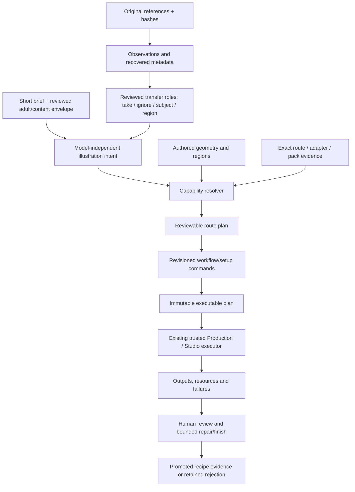

# Architecture: intent, controls, routes and evidence

## 1. Product model

The user starts with an outcome, not a graph:

> Keep this approved adult character, use this pose and camera, borrow the robe construction from another image, use the third image only for palette and rendering, and create a warm hot-spring illustration without copying any source background.

The Studio turns that into one reviewed intent and one explainable route plan. A route may compile parts of the intent to prompt text, tag tokens, geometry maps, image-reference slots, LoRA weights, masks or deterministic finishing operations. Unsupported requirements remain visible.

## 2. Reused owners

- `studio_prompt` remains the source of model-independent creative intent, profile compilation, helper proposals and reference analysis.
- `studio_workflow` remains the source of revisioned workflow documents, reusable modules, Steps/Nodes and shared agent commands.
- Workspace remains the asset, lineage and persisted-command boundary.
- Production/Studio remains the only generation coordinator and Comfy submission owner.
- Model Library and Bundle customization retain exact file/version/compatibility ownership.
- Character consistency retains canon and per-actor review.
- Repair Studio retains source, transforms, masks, scoped repair, contact and finishing contracts.
- Krita and Blender remain the native editing and authored-geometry escape hatches.

This programme supplies domain vocabulary, route claims, pack composition and qualification evidence. It owns none of the above persistence or execution mechanisms.

## 3. Records

### 3.1 Illustration intent

The intent states what must be true:

- subject identity and adult assertion;
- body/silhouette design;
- pose, action and relationships;
- wardrobe, coverage, construction and materials;
- expression and gaze;
- camera, framing and composition;
- environment, lighting, palette and atmosphere;
- rendering medium/style;
- exact text and exclusions;
- references with reviewed contribution;
- content envelope;
- local edit target and preservation rules where applicable.

It contains no checkpoint filename, node ID, LoRA filename, sampler folklore or execution permission.

### 3.2 Source and observation records

Keep three records separate:

1. **source/recovered metadata** — bytes, hash, container fields, embedded claims and graph fragments;
2. **visual observation** — what a pinned helper/tagger/pose/segmenter reported, with confidence and transforms;
3. **reviewed transfer intent** — what the user deliberately chooses to take or ignore.

A tagger cannot recover the original prompt. A VLM cannot certify identity, age, consent, hidden anatomy, licence or author. Embedded workflow metadata is untrusted data and never executable authority.

### 3.3 Geometry plan

Geometry is an inspectable artifact:

- canvas and camera;
- actor bounds and instance IDs;
- pose/keypoints and authored/estimated provenance;
- silhouette;
- depth, normals, line/sketch and segmentation;
- contacts and local occlusion;
- crop, pad and scale transforms;
- control strengths and schedules only after a compatible route is selected.

Pose, depth, regional text and final pixel-write masks are different types. A generated or estimated guide does not grant permission to edit.

### 3.4 Route card

A route is an exact bundle and graph configuration:

- model source revision and file identity;
- architecture, prediction type, encoders and VAE;
- precision/quantisation and loaders;
- graph/template and custom-node revisions;
- prompt dialect and negative semantics;
- supported resolutions and schedule;
- native reference slots, order and transforms;
- supported geometry/adapter/mask capabilities;
- measured runtime/resource evidence;
- terms snapshot;
- evidence state.

Evidence progresses through:

`discovered → source_reviewed → hash_verified → installed → graph_validated → executed → visually_reviewed → task_accepted → promoted`

No later state is inferred. Quantised, accelerated and native/full configurations are separate routes.

### 3.5 Adapter qualification record

A LoRA/adapter is classified by function: identity, outfit, body/proportion, pose/action, expression, camera/composition, style, material/effect, detail/repair or acceleration. Its record contains exact base compatibility, triggers, author settings, tested interval, collateral effects, pairwise interactions, evidence and terms.

A continuous UI slider is promoted only if its measured response is ordered enough over a bounded interval. An unstable effect remains an experimental named preset.

### 3.6 Genre pack

A genre pack is a transparent module selection over the same intent:

`Draft composition → Lock geometry → Preserve identity/outfit → Render → Review → Repair → Finish`

It declares defaults with provenance, compatible routes, prerequisites, omissions and candidate cost. It never becomes an opaque mega-prompt, hidden model install or alternate executor.

### 3.7 Qualification campaign

The benchmark declaration fixes tasks, sources, routes, settings and caps before execution. Results retain all candidates and distinguish:

- successful execution;
- hard-constraint result;
- visual review;
- owner acceptance;
- rights review;
- route/recipe promotion.

## 4. Capability resolution

The resolver answers:

1. Which requirements are semantic, geometric, appearance, pixel-authority or deterministic finishing controls?
2. Which installed exact routes support them?
3. Which requirements need reviewed substitutions or native work?
4. What reference slots and transforms will actually be used?
5. What is unknown?
6. What resource and candidate budgets apply?
7. Which approval boundary follows?

It returns alternatives and diagnostics; it never fabricates compatibility. A backend input named `negative` does not prove effective negative conditioning. A model family name does not prove LoRA or ControlNet compatibility.

## 5. Human and agent authority

Read/inspect/import/analyse/compile/diff/plan/prepare operations submit no generation, install nothing and switch no environment. Every write carries request identity and expected revision. Execution uses the existing trusted path and explicit approval.

After transport loss, clients observe the retained request/ticket/job identity. They do not create a new identity and resubmit. Agents may propose but cannot self-certify adult status, consent, art acceptance, rights clearance or promotion.

## 6. Resource model

The RX 9070 XT has 16 GB VRAM, but compatibility is measured per exact route. Model file size is not resident memory. Record VRAM, host RAM/Windows commit, cold/warm/model-switch timing, unload behaviour, spill, OOM and crash. Analysis models unload before heavy generation where the shared coordinator requires it.

Windows and Linux configurations are separate evidence records. A working Comfy HIP runtime does not prove another runner or trainer supports the same card.

## 7. Rollout

- A0 ships static docs/manifests, validator and agent skill.
- A1 maps the intent to current Prompt/Workflow records and one finite comparison.
- A2 adds qualified modules one at a time.
- A3 adds role-separated multi-reference and coupled regions.
- A4 exposes transparent genre packs.
- A5 qualifies one justified training route and finishing chain.
- A6 enables shared UI/CLI/SDK/MCP commands.

Capability flags stay false until exact fixtures and owner-run evidence justify them.
