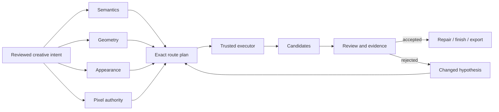

# Controlled adult anime art direction

Research and architecture record for the adult-only sensual/anime illustration programme. Research freeze: **15 September 2026**. Programme owner: [#403](https://github.com/Chris0Jeky/local-asset-studio/issues/403). This document turns the programme's control ontology into practical creative, technical and agent-operable workflows.

The target is not one unusually permissive checkpoint or one attractive style LoRA. The target is a system that can answer, separately and visibly:

1. **What should be depicted?**
2. **Where should every subject, garment and prop be?**
3. **Whose appearance and which visual treatment should be preserved?**
4. **Which pixels may change?**
5. **Which exact route produced the result, and was the result actually useful?**

Text describes. Geometry constrains. References and adapters preserve or modify appearance. Masks define write authority. Review decides whether an output is useful. No mechanism should impersonate all five.

## 1. Scope and content envelope

The programme is for **reviewed adults only**. Adult status comes from owner/canon metadata, not from visual inference, tagger output or negative prompting. Multi-adult intimate scenes additionally require reviewed consent-context metadata. Ambiguous or youthful identity is refused before route planning.

The first public and software-test envelope is `sensual_non_explicit`, with synthetic fixtures and opaque critical coverage. Broader adult content classes, where supported by an exact local route and intended use, require separate content declarations, source review, route evidence and output review. A model family or local execution path is never labelled universally unrestricted.

Keep these facts distinct:

- reviewed adult/canon declaration;
- requested artistic content class;
- model or application policy behaviour;
- successful generation;
- visual acceptance;
- rights/export review.

## 2. Control planes



### 2.1 Semantics

Use prompts, verified tags and natural-language instructions for:

- subject count and ownership;
- identity description when no stronger identity mechanism exists;
- wardrobe concept and garment names;
- action and relationship intent;
- expression and gaze;
- environment, props and narrative context;
- lighting, palette and material intent;
- rendering medium and mood;
- exclusions that the exact profile supports.

Semantics are not reliable substitutes for precise body geometry, camera placement, reference routing or local write masks.

### 2.2 Geometry

Use reviewed geometry artifacts for:

- pose and weight distribution;
- silhouette and proportions;
- camera elevation, yaw, framing and subject bounds;
- depth, normals and foreshortening;
- line/edge structure;
- contact topology;
- subject regions and occlusion.

An estimated skeleton or depth map is an observation, not an unquestionable target. Make missing, uncertain and manually corrected joints explicit. Preserve source, coordinate system, canvas transforms, renderer identity and revisions.

### 2.3 Appearance

Use role-specific references and qualified adapters for:

- character identity and body design;
- outfit construction and accessories;
- expression or recurrent gesture;
- palette and material treatment;
- linework, shading, medium and visual era;
- local effects such as steam, water, bloom or neon.

Identity, outfit and style should remain separable. A character LoRA that memorises one costume and one rendering style may look consistent while failing every variation task.

### 2.4 Pixel authority

Use masks and protected compositing for:

- local wardrobe changes;
- anatomy/contact repair;
- face or expression correction;
- material substitution;
- background or prop replacement;
- exact preservation outside the edited region.

A regional prompt, segmentation observation or pose map does not grant write authority. A global redraw or diffusion refinement is a new derivative and cannot inherit an exact outside-mask preservation claim.

### 2.5 Evidence

Record separately:

- exact model, encoder, VAE, prediction type and quantisation;
- graph and custom-node revisions;
- prompt profile and vocabulary revision;
- references, roles, transforms and hashes;
- geometry and mask artifact identities;
- seed/noise identity and sampler schedule where applicable;
- cold/warm timing and measured resource use;
- failure class;
- review facts, owner acceptance and rights state.

## 3. Independent art-direction axes

"Ecchi" is a broad art-direction label, not a useful single control. Represent it as independent reviewed axes. Each axis compiles to the mechanism that actually controls it.

| Axis | Example intent range | Preferred mechanisms | Common failure |
| --- | --- | --- | --- |
| Adult presentation | understated to strongly mature | canon, identity description, identity adapter | youthful drift, inconsistent face/body age coding |
| Silhouette emphasis | subtle to pronounced | silhouette/depth artifact, qualified proportion slider | prompt-only exaggeration, anatomy collapse |
| Body design | athletic, soft, tall, compact, stylised | canon, identity/body adapter, geometry | identity/body style entanglement |
| Wardrobe construction | simple to layered/ornate | outfit reference, outfit LoRA, regional edit | copied source person or background |
| Coverage | ordinary to revealing non-explicit | reviewed content declaration, garment mask, prompt/profile hint | accidental exposure, contradictory layers |
| Fit and drape | loose to fitted | garment reference, material/outfit adapter, local edit | painted-on fabric, broken folds/contact |
| Material | matte, silk, wet, glossy, translucent overlay | material reference/adapter, lighting, local edit | global plastic skin or lost garment edges |
| Pose suggestiveness | neutral to pin-up/fanservice | authored pose, silhouette, action semantics | rigid ControlNet body, bad support/contact |
| Camera intimacy | environmental to close | camera blockout, crop/aspect, composition semantics | accidental distortion or identity loss |
| Expression/gaze | neutral to confident/flirtatious | expression adapter, face reference, semantic prompt | expression changes identity |
| Lighting intensity | natural to theatrical | lighting reference, prompt, relight route | clipped skin, oversaturation, flat steam |
| Narrative context | ordinary to stylised sensual setting | scene recipe, layout, props | scene tokens overpower subject |
| Rendering style | cel, painterly, manga, retro, game art | style reference/adapter after structure is stable | style erases face, clothing or anatomy |
| Explicitness/content class | fixed reviewed envelope | content metadata, route declaration, final review | relying on one tag or negative prompt |

Do not expose a UI slider unless its response is measured as ordered and sufficiently stable over the qualified route and interval. Unstable effects remain named presets or experimental controls.

## 4. Character canon and reusable identity

A recurring original character needs a reviewed canon, not one favourite image.

Recommended canon material:

- neutral front, three-quarter and profile portraits;
- full-body front, side and rear views;
- neutral pose plus several deliberately different poses;
- expression sheet;
- hair construction and markings;
- palette swatches;
- body-proportion declaration;
- accessory and garment breakdowns;
- invariant versus optional details;
- style-neutral or minimally styled references where possible.

Maintain four distinct records:

1. **Identity canon** — face, hair, eyes, markings, stable body design.
2. **Wardrobe canon** — garment construction, layers, fasteners and accessories.
3. **Style canon** — line, colour, shading, texture and medium.
4. **Presentation examples** — pose, expression, camera and lighting.

A generated derivative does not automatically join the canon. Repeated generation should re-anchor to accepted canon rather than chain uncontrolled generated drift.

## 5. Reference-role routing

Every reference should state what to transfer and what to ignore.

```json
{
  "id": "robe-study",
  "source_sha256": "...",
  "roles": ["outfit", "material"],
  "subject_id": "adult-a",
  "region_id": "wardrobe",
  "take": ["robe construction", "towel layering", "silk drape"],
  "ignore": ["source identity", "source pose", "source background"],
  "crop_transform_id": "crop-robe-v2",
  "confidence": "reviewed",
  "native_binding": null
}
```

The eventual route plan adds the exact native slot, preprocessing, weight and order. Analysis capacity and native slot capacity are different: four references may be analysed together even when a generator supports only three image slots.

### Reference leakage checks

For each source, score:

- intended facet transfer;
- copied ignored identity;
- copied ignored wardrobe;
- copied ignored pose/camera;
- copied ignored background/text;
- palette or style leakage;
- order sensitivity;
- crop/resize sensitivity.

Do not average unrelated references into one embedding unless that exact baseline is being measured deliberately.

## 6. Staged creation workflow

### Stage 0 — Review intent

Capture:

- reviewed adult/canon facts;
- content envelope and coverage;
- subject ownership;
- desired changes versus invariants;
- references and roles;
- delivery dimensions and use;
- hard versus soft constraints.

No route is selected yet.

### Stage 1 — Build composition

Use a lightweight route and minimal controls to decide:

- aspect and framing;
- subject count and placement;
- pose readability;
- silhouette;
- camera angle;
- scene balance;
- key contact points.

Generate contact sheets at low cost. Do not repair hands, texture or eyelashes before the composition is accepted.

### Stage 2 — Lock geometry

Refine only the controls needed by the failure:

- corrected pose/keypoints;
- silhouette/segmentation;
- depth or normals for difficult perspective;
- line/edge guide;
- joint contact regions;
- camera/blockout.

Use the smallest compatible set. Excess simultaneous controls can produce rigidity, flattened depth and poor garment behaviour.

### Stage 3 — Preserve identity and wardrobe

Add role-specific mechanisms in this order unless route evidence indicates otherwise:

1. identity/canon reference or identity LoRA;
2. outfit reference or outfit LoRA;
3. body/proportion control;
4. expression control;
5. style/material control.

Re-evaluate after each addition. Do not debug a five-adapter stack as one black box.

### Stage 4 — Quality render

Switch from the fast preview route to a qualified quality route while preserving:

- exact reviewed intent;
- geometry artifacts;
- reference ownership;
- route-specific prompt profile;
- candidate cap and evidence identities.

A seed number does not align noise across unrelated architectures.

### Stage 5 — Scoped repair

For each visible defect:

1. identify the exact instance and defect;
2. classify visible, occluded, out-of-frame or uncertain;
3. create a context crop;
4. create writable and protected masks;
5. choose a materially different repair hypothesis;
6. generate a bounded candidate set;
7. composite the accepted patch;
8. verify protected pixels and final-size usefulness.

Do not run unconditional global face/hand detailers over every accepted image.

### Stage 6 — Finish

Keep finishing stages reversible and separately identified:

- deterministic crop/layout;
- illustration-aware upscale;
- optional low-denoise reconstruction;
- colour/contrast;
- sharpening/grain;
- typography/panel layout;
- export profile.

Review identity, contacts, garment edges, coverage, line quality, seams, invented texture, banding and text at final size.

## 7. Functional LoRA and adapter portfolio

Organise adapters by function, not by popularity or gallery style.

| Class | Intended role | Primary risks |
| --- | --- | --- |
| Identity | face, hair, markings, stable body design | costume/style/pose memorisation |
| Outfit | garment construction and accessories | identity/background leakage |
| Body/proportion slider | controlled silhouette change | non-monotonicity, anatomy drift |
| Pose/action | learned movement/fabric interaction | conflict with authored geometry |
| Expression | gaze, eyelids, blush, mouth state | face/identity replacement |
| Camera/composition | recurring visual layout | distortion, over-constrained framing |
| Style | line, shading, era, medium | identity and garment erasure |
| Material/effect | silk, wet surface, steam, neon, bloom | global plastic texture, clipped highlights |
| Detail/repair | local anatomy or rendering aid | unwanted global changes |
| Acceleration | reduced-step schedule | lower diversity/quality, schedule mismatch |

### Adapter evidence card

Every adapter candidate should retain:

```text
provider / model / version / file / SHA-256
exact compatible base and lineage
rank, alpha and paired components where known
trigger vocabulary and author claims
terms snapshot
route, graph and loader revisions
weights or schedules tested
intended and protected facets
observed collateral effects
pairwise interactions
accepted and rejected examples
measured resource and cleanup cost
source-reviewed / installed / executed / reviewed / accepted state
```

### Qualification sequence

1. No-adapter baseline.
2. Single-adapter sweep over bounded weights.
3. Ordinary and difficult pose; portrait and full-body framing.
4. Multiple seeds/noise initialisations.
5. Intended effect scored separately from identity, outfit, anatomy, pose, camera and style drift.
6. Primary identity adapter plus one candidate adapter.
7. Important pairs.
8. Intended production stack.

A body, expression or intensity slider is promoted only when it demonstrates an ordered response across the chosen interval, tolerable seed sensitivity, known saturation and acceptable collateral effects. Otherwise expose named presets, not a continuous dial.

## 8. Prompt profiles versus controls

Prompt profiles solve model dialect, not geometry or reference binding.

- **Animagine XL 4 profile:** ordered verified tags and separate negative channel.
- **Anima Aesthetic profile:** lowercase space-separated tags plus concise reviewed prose; no inherited Pony conventions.
- **Qwen Image Edit 2511 profile:** explicit image order, role ownership, take/ignore rules, requested edit and preservation constraints.

The deterministic compiler is documented in [Prompt profiles](PROMPT-PROFILES.md). Unknown vocabulary and non-prompt controls remain visible diagnostics.

## 9. Route portfolio

Maintain a small role-based portfolio rather than one universal winner.

### Fast draft route

Purpose: composition, pose and scene exploration. It should be cheap enough to discard outputs freely. A fast model or accelerated schedule is a separate route configuration, not a quality-equivalent alias.

### High-quality anime route

Purpose: final illustration from accepted composition. Candidate families include Anima Aesthetic and one reproducible SDXL anime baseline. Exact checkpoint, prompt profile, controls and local runtime must be qualified separately.

### Precision assembly route

Purpose: scenes needing explicit pose, silhouette, camera, identity, outfit and regional control. Likely combines a qualified anime checkpoint, geometry controls, role-specific references/adapters and scoped masks.

### Native multi-image edit route

Purpose: semantic composition or change from several ordered images. It should retain explicit source ownership, slot limits, internal crop/resize evidence and preservation instructions.

### Repair route

Purpose: local anatomy, garment, contact or identity correction. It must accept explicit context/write/protection artifacts and return a candidate suitable for protected compositing.

### Finishing route

Purpose: upscale, refinement, colour and export. It does not rescue an unaccepted base composition.

## 10. Genre and workflow portfolio

Genre packs should be transparent presets over independent controls, not opaque mega-prompts.

| Pack | Primary control emphasis | Typical risks | Useful escape hatch |
| --- | --- | --- | --- |
| Pin-up/editorial | silhouette, pose, camera, gaze, clean background | anatomy/camera exaggeration | authored silhouette and camera blockout |
| Fashion/lingerie | garment construction, coverage, material, editorial light | garment fusion, accidental exposure | outfit reference plus regional garment edit |
| Swim/beach | body/pose, fabric, water, daylight | wet-material artefacts, background dominance | material mask and lighting pass |
| Hot-spring/steam | coverage, robe/towel layers, steam, mixed light | lost edges, copied source identity | outfit regions and protected coverage review |
| Lounge/sleepwear | drape, relaxed pose, indoor light | collapsed fabric and furniture contact | depth/contact artifact |
| Athletic/stretch | joint range, weight distribution, sportswear | implausible spine/limbs | corrected skeleton plus silhouette/depth |
| Fantasy glamour | costume layers, props, magical light | accessory loss and visual overload | separate prop/costume regions |
| Sci-fi/cyber | hard-surface wardrobe, emissive material, city light | anatomy hidden by detail/noise | line/segmentation controls |
| Street fashion | outfit mix, perspective, urban scene | source/background leakage | subject segmentation and style-limited reference |
| Comedy/fanservice | readable action, expression, timing | pose ambiguity, accidental content drift | storyboard/layout first |
| Action | dynamic pose, foreshortening, effects | anatomy/contact failure | 3D proxy or depth/normal escalation |
| Manga/panel | line style, panel layout, expression/text | inconsistent figures and lettering | separate figure generation and deterministic layout |
| Character sheet | canon consistency, repeated poses, clean background | identity/costume drift across cells | per-instance canon plus layout compositor |
| Two-adult scene | per-subject identity, joint pose/contact, regional ownership | identity swap and broken contact | one joint geometry/contact plan |
| Scoped edit/repair | write mask, preservation, matched route | seam/style drift, no-op | native/manual edit or changed repair hypothesis |

Every pack declares prerequisites, compatible promoted routes, candidate cost, unsupported controls and manual/native alternatives.

## 11. Difficult-scene escalation

### Extreme poses and foreshortening

1. Correct the pose representation.
2. Add silhouette.
3. Add depth/normals.
4. Add hand/foot contours where important.
5. Escalate to a Blender/mannequin proxy when 2D keypoints are insufficient.
6. Change route only after the geometry is known to be useful.

### Two-subject contact

- author one joint pose/contact plan;
- use subject-specific identity and outfit bindings;
- describe foreground/background or left/right ownership;
- maintain a shared contact region;
- inspect depth crossings locally;
- repair the contact jointly;
- score identity per subject.

### Layered or dynamic clothing

- preserve a garment-construction reference;
- represent body/garment contacts and occlusion;
- use material treatment only after construction is correct;
- prefer a regional edit over global redraw for one garment failure.

### Hands, props and supports

A hand-object or body-surface contact needs enough surrounding context to make force, grip and support understandable. Repeated prompt changes rarely fix a wrong contact topology; change the geometry or local repair hypothesis.

## 12. Benchmark and promotion

Do not collapse control, beauty and usefulness into one score.

Report separately:

- subject count and hard constraints;
- adult/content-envelope adherence;
- identity per subject;
- outfit/coverage/material;
- pose/camera/contact;
- reference transfer and leakage;
- anatomy/occlusion class;
- style/palette/lighting;
- outside-mask preservation where applicable;
- accepted distinct tasks within cap;
- attempts, interactions, waiting and cleanup;
- cold/warm/model-switch time;
- VRAM, host RAM and Windows commit where measured;
- refusal, unsupported control, no-op, OOM, crash and uncertain submission.

Promotion is task-scoped. A route may be promoted for fast composition and rejected for identity-critical final rendering. A LoRA may be promoted only over a narrow weight interval. A genre pack may remain experimental even when every module works individually.

## 13. AMD RX 9070 XT operating tiers

Treat resource fit as measured evidence, not a weight-file estimate.

### Interactive tier

- one fast route;
- batch size one or a fully counted small batch;
- one geometry control;
- one identity mechanism;
- model-native resolution;
- no resident VLM/tagger during generation.

### Quality tier

- full quality route;
- pose plus at most one secondary geometry control initially;
- one identity and one outfit/style mechanism;
- sequential preprocessors;
- explicit cold/warm measurements.

### Heavy edit tier

- one quantised/offloaded multi-image editor configuration;
- one candidate at a time;
- analysis helpers unloaded first;
- VRAM, system RAM, Windows commit and spill recorded;
- uncertain execution reconciled, never blindly replayed.

Windows and Linux runtime comparisons are different route configurations. Working SDXL execution does not prove another multimodal runner supports the same GPU path.

## 14. Agent decision procedure

An agent working on this programme should:

1. Validate the reviewed adult intent and content envelope.
2. List unresolved controls by plane: semantic, geometry, appearance or pixel authority.
3. Inspect exact installed route evidence; never infer from a research candidate.
4. Choose the smallest route capable of the hard controls.
5. Compile the exact prompt profile without mixing model dialects.
6. Preserve reference roles, order, transforms and hashes.
7. Produce an inspectable zero-authority setup/comparison plan.
8. Explain unsupported fields and manual/native alternatives.
9. Require explicit approval for execution.
10. Observe the exact ticket/job identity and retain every outcome.
11. Record independent review; never self-promote its own result.
12. Change the hypothesis after a repeated failure or stop at the cap.

Prepare, inspect, compile and compare-plan commands submit **zero** neural jobs. Execution uses the existing Workflow/Production coordinator, resource gates and durable identities.

## 15. Delivery order

1. Merge and reconcile the non-executing foundation and intent contracts.
2. Complete exact prompt profiles and small verified vocabulary under #437.
3. Merge geometry-first pose correction under #407/#443–#446.
4. Reconcile installed routes and source snapshots.
5. Execute the bounded route campaign under #439.
6. Qualify adapter intervals/interactions under #440.
7. Demonstrate one character-plus-pose and one character-plus-outfit/style result.
8. Add one transparent guided genre pack under #410.
9. Demonstrate scoped repair and finishing.
10. Extend UI/CLI/SDK/MCP parity only through shared commands and existing authority boundaries.

## 16. Primary implementation owners

- #403 — programme and evidence gates.
- #404 — model-independent intent and control ontology.
- #405/#439 — exact route qualification on the workstation.
- #406/#440 — LoRA, slider and interference qualification.
- #407/#443–#446 — geometry-first pose control.
- #408 — role-separated multi-reference and multi-adult scenes.
- #409 — benchmark corpus and acceptance rubric.
- #410 — composable genre packs and guided journeys.
- #411 — justified isolated LoRA training.
- #412 — repair, upscale and finishing.
- #413 — shared agent commands.
- #432/#437 — prompt dialect, verified vocabulary and deterministic profiles.
- #433/#438 — evidence-gated provider source intake.

No planning document, source snapshot or prompt projection authorizes acquisition, runtime changes, generation, training or publication.
