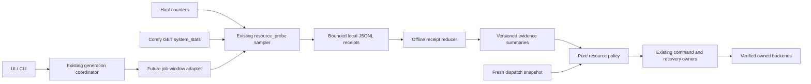

# Resource orchestration architecture

## Owners and data flow

The diagram is the target design; only the existing sampler/receipt path precedes this work. No second worker, authoritative job store, reservation ledger, browser-driven executor or per-browser sampler is allowed.

## Decisions

**D1 — Observation never acts.** `resource_probe` observes; the first `performance_history` reducer consumes already-written bytes. Neither imports Studio/Torch, starts services, frees caches, changes flags, reorders jobs or terminates processes. Future HTTP observation goes through #175's single-flight bounded projections. PID observation is not permission to manage a PID.

**D2 — Evidence is explicit and local.** Summary v1 records receipt and sampler hashes, requested/observed sample counts, per-counter known/unknown counts, sampled extrema, first/last timestamp and profiler cost. Allow-list output fields. No raw paths, prompts, command lines or arbitrary notes. Use bytes for memory; never silently mix decimal MB and MiB. Retain original receipts under ignored `.runtime/`; no growing in-memory history list. A future job adapter stores a small summary reference alongside existing run evidence, with bounded raw retention and atomic writes.

**D3 — Missing is not zero, and observation is not completion.** A valid zero remains zero. Null, inaccessible, non-finite, Boolean or contradictory counters are unavailable with coverage. Offline GPU readings cannot prove fit. Metadata-only/interrupted receipts remain useful but incomplete. Concatenated runs, reordered timestamps and version/device-layout changes cannot be silently reduced into a comparable run. Reject malformed envelopes and identity drift. Same-version backend restarts remain unobservable in v1; disclose it. Never infer generation outcome, phase duration or historical safe thresholds from sampler completion.

**D4 — Policy is pure and versioned.** Future `evaluate(job_requirements, fresh_snapshot, matching_history, policy_config)` returns allow/hold/unknown and structured reason codes, required/observed values, evidence IDs and proposed actions. It does not execute an action. Reuse #178 and the deployed host gate; history may add caution, never waive fresh validation. Dimensions, references, graph/model/precision and runtime identities must match before history informs a decision. Interactive/balanced/throughput are future policies with explicit trade-offs, not defaults shipped here.

**D5 — Freshness belongs at dispatch.** Preparation may show advisory data; after waiting, the existing coordinator takes fresh observations and rechecks selected runtime identity/queues before submission. Local reservations coordinate LAS auxiliary work but do not reserve physical OS memory. Native ComfyUI clients can still submit independently; the UI must not claim exclusive GPU ownership. No retries of unknown prompts and no mutation of retained IDs.

**D6 — Lifecycle commands remain separately consented.** A prepare-large-job command checks Studio jobs, production stages, Comfy queue and unresolved submissions. If permitted it releases only owned resources, measures again, and only then proposes or performs a separately enabled owned idle restart. Revalidate identity and queue immediately before action; stale checks do not authorise termination. `/free` HTTP success alone cannot report Ready. Abort on unknown state. Keep measured before/after receipts and recovery provenance.

**D7 — Browser ownership is opt-in.** Existing external and NoBrowser behaviour stays intact. A future managed window uses a dedicated profile, created-process identity and identity revalidation; profile path or executable name alone is not authority. Submission must be durably acknowledged before closing an owned window. Never close unrelated Chrome/Edge sessions. Reopen is deduplicated after terminal completion; cancellation/partial/uncertain states have their own notification policy. Closing observation never cancels computation.

**D8 — Preserve intent and ordering.** Interactive FIFO remains default. Locality optimisation is restricted to explicitly reorderable independent batch items with a stable tie-break, dependency preservation and starvation bound. Cache compatibility includes graph/model/adapter/precision/runtime identity, not a friendly family name alone. A fallback produces a new reviewable graph and recipe diff (batch, references, tiling, resolution, offload); it cannot silently change the approved workload or spend a new allowance.

## Failure, rollout and rollback

Keep observation, advisory decisions and enforcement as separate releases. Telemetry failure must not erase a completed output or relabel an already completed job; the existing safety gate remains authoritative. Disk-full/permission failures retain existing receipt evidence and return a bounded unavailable state. Measurements cannot become an unbounded event log or periodic workload of their own.

Initial rollback is removing the optional offline tool; it has no live configuration to restore. Later policy rollout needs fixtures for unknown counters, stale epochs, external queue changes, PID reuse, interrupted persistence and dropped replies before a local finite proving budget. Lifecycle rollback returns to external/headless observation and the recorded prior launch policy, never deletes uncertain work.
