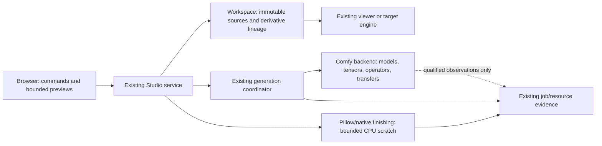

# Architecture and decisions

Source basis: audit pp. 8–10, 17–25, 28–31. The decisions below are repository-specific proposals or bounded implementations, not descriptions copied from the PDF.

## ADR-LL1: optimise at the owner that actually holds the bytes



The browser never becomes an inference worker. Studio never manipulates arbitrary backend tensor pointers or reimplements vendor model-viewer internals. A renderer upload ring is meaningful only inside the owner that understands device buffers and their completion fences. Python request completion is not such a fence.

Keep physical available RAM, Windows committed bytes/headroom, process working set/private memory, backend tensor allocated/reserved bytes and device-wide memory separate. Do not sum measurements from overlapping accounting domains. Historical sampled peaks are observations, not guaranteed admission bounds. #178 remains the fresh pre-submit policy owner; #306 remains owned lifecycle preparation.

Rejected alternatives: a universal asset/tensor cache (incompatible lifetimes and security); a native renderer rewrite (unmeasured bottleneck); a second background optimiser/queue (competing ownership).

## ADR-LL2: deterministic derivatives before a new compiled format

Workspace source identity remains authoritative. Retain the repository's SHA-256 convention; the report's BLAKE3 sketch does not justify migrating stored identities.

A proposed derivative key is a canonical structured record, not ambiguous string concatenation:

```text
schema + operation/version + ordered input SHA-256 values
+ source interpretation (mode, orientation, profile/alpha policy)
+ exact crop/resize/filter/normalisation options
+ relevant library/adapter version + target representation
```

An entry contains key, source links, output hash/bytes/dimensions, complete transform, creation state and compatibility scope. It is disposable. The source and historical review/command receipt are not cache entries and cannot be evicted with it.

Lookup sequence: capture and validate the source snapshot → derive effective key → check complete entry and bounded payload → verify output integrity → return derivative handle. On miss: estimate decoded/scratch/output bytes → obtain existing auxiliary-work admission → process one bounded item → write to a private temporary location → flush and publish atomically → release scratch/admission in `finally`. Concurrent builders for the same key coalesce or lose publication harmlessly; no partial file becomes a hit. Workspace metadata and filesystem publication are not a fictitious cross-system atomic transaction: recovery treats orphan derivatives as disposable.

Start with previews under #177, not model weights. Do not allocate all crops before publishing: #360 records that as a separate measured follow-up. A dimension cap, encoded-byte cap, aggregate live-byte cap and concurrent-worker cap serve different purposes.

Full-source hashing can itself dominate warm lookup. Reuse a trusted immutable Workspace snapshot identity where the existing owner permits it; never turn a filename/mtime hint into proof of unchanged external bytes. Do not introduce a new stale cache shortcut in the protected-edit boundary.

## ADR-LL3: exact conditioning reuse is a separate backend contract

Potential reuse under #11/#35 must key the complete effective operation: encoder/tokenizer/projector and model/adapter revisions, exact prompt semantics, ordered references and their roles/transforms, latent/video/audio/anchor state, shapes, dtype/layout, implementation and relevant device/runtime identity. Missing identity means no exact hit. Do not drop an anchor, mask, negative condition or size-dependent component to make a cache key smaller.

Use an allowlisted tensor/metadata representation with shape, dtype and byte caps, checksums and schema validation; never load arbitrary downloaded pickle caches. Reusing deterministic conditioning is not caching a stochastic generation outcome. Seed alone is not a complete computation identity. No cache hit confers generation authority or changes experiment accounting.

Retain caches only when measured avoided work exceeds validation/loading overhead and memory opportunity cost. Proposed diagnostic, not an automatic policy:

```text
net_reuse_ms = recompute_ms - key_and_validation_ms - load_ms - restore_ms
retention_value = expected_reuses * net_reuse_ms / retained_bytes
```

Use the score only among compatible, evictable candidates. Admission, explicit user order, exactness and unresolved-job ownership outrank it. This is a hypothesis to test through #305, not a new production eviction formula.

## ADR-LL4: bound scratch lifetimes without weakening evidence

The protected-pixel operation returns a full L mask: its output necessarily costs O(width × height). Caller-owned inputs and their decoders also remain full images. What can be bounded is the temporary RGBA conversion/difference/channel work.

Process fixed square tiles, convert only those regions to RGBA, combine all four channel differences, threshold to 0/255 and paste into the output mask. Square tiling bounds both very wide and very tall inputs. Close tile conversions, differences and bands at each iteration, including exceptions. Do not use alpha-only bounding boxes or RGB-only equality: invisible RGB changes are still decoded-pixel changes.

For review decode, bypass EXIF transpose only when its orientation is not one of 2–8. Continue returning an independent RGBA result, the existing transform record and empty preview metadata. Keep the existing maximum pixels, still-image, format and mode refusals. This avoids one intermediate; it does not make decoding zero-copy.

The first two changes need no API migration, new dependency, background worker or cache. Reverting either implementation restores the prior path without rewriting persisted sources/receipts.

## ADR-LL5: a copy ledger is observation, not another state store

A future bounded observation should record operation, source/target memory domain, bytes, clock domain, evidence kind (`measured`, `estimated`, `unavailable`) and lifetime/identity where available. Keep operation-local byte counts distinct from process peak RSS. A tensor view is not a copy; serialization, layout materialisation, CPU-to-device DMA and device-to-host readback are different events.

Stable suggested scopes: `source.capture`, `media.decode`, `media.orient`, `media.convert`, `media.compare`, `model.load`, `conditioning.encode`, `sample`, `vae.decode`, `output.encode`. Emit a scope only when a real owner supplies boundaries. Poll-window time cannot be relabelled VAE time. Backend GPU timestamps require explicit clock-domain correlation; concurrent durations are not additive wall time.

Reuse #302 job identities and receipt references. No raw pixels/tensors/prompts in public diagnostics. Cap event count, total bytes, retention and export time; overflow retains a truncated/incomplete marker. Observation failures must not change a job's success/failure or lose a prompt ID. #359's receipt timing concerns remain with that owner, not silently fixed by a new schema.

## ADR-LL6: kernel work is gated and reversible

The next inference step is #364's short qualified trace, then one intervention selected from measured operator cost. Preserve an eager/unchanged baseline. Shape bucketing must include reference count, sequence/frame length and resolution; compile cost, recompile storms and retained graph memory count against benefit. A quantised file can expand or convert during loading, so weight-file size is not runtime memory or matmul speed.

Pinned transfers and asynchronous execution need an actual dependency/lifetime proof. Reuse a buffer only after the consuming operation completes. Do not add global synchronisation to every production operation to make a benchmark easy. Do not force SDPA/CK/Triton/other attention paths from documentation alone: exact build, dtype, shape and installed kernel support must be demonstrated in the isolated candidate.

Fallback means a visible return to the unchanged implementation, not lower resolution, dropped references or another uncharged generation. Native crash, OOM or uncertain submission stops the trial. #303 owns any candidate environment, and shared driver/OS changes require their own plan.
