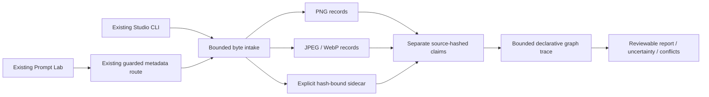

# Output-aware recipe inspection

Implementation slice of issue #36. Extends the existing Prompt Lab, metadata route
and CLI; it does not introduce a queue, model call, workflow importer or reference
library. Reconciliation baseline: main `2b911092`, including merged #78. No open PR
was present when the slice was reserved on #36.

## Use it

Open `/prompt-lab.html` in the running Studio and choose a PNG, JPEG, WebP or
schema-v1 recipe sidecar in **Inspect an example's embedded recipe**. This is
explicit metadata inspection, not image analysis by a vision model. The browser
accepts files up to 650,000 bytes. It presents the complete report as text, never
as imported HTML, displays a pending-inspection message, and ignores stale
success/error responses after a newer file selection. Opening the page submits no inspection or generation.

For larger files, an attached sidecar or explicit output-node selection:

```sh
python scripts/studio_prompt.py inspect-media example.webp --out inspection.json
python scripts/studio_prompt.py inspect-media example.png --sidecar example.sidecar.json --out combined.json
python scripts/studio_prompt.py inspect-media example.png --output-node 9 --out selected.json
```

`--out` requires a new file. Omitting it prints JSON. The old `inspect-png` command
and `png_base64` request field remain supported; the latter still requires PNG
bytes. Inputs are identified by their byte signatures, not their extensions.
Only an explicitly supplied sidecar is read. There is no adjacent-file discovery,
path interpretation inside metadata, model download or network lookup.

The existing same-origin endpoint accepts this JSON shape:

```json
{
  "media_base64": "BASE64_OF_ORIGINAL_FILE",
  "sidecar_base64": "OPTIONAL_BASE64_OF_EXPLICIT_SIDECAR",
  "output_node": "OPTIONAL_KNOWN_OUTPUT_NODE_ID"
}
```

Omit optional fields rather than sending null. Exactly one of `media_base64` and
legacy `png_base64` must be present. The real HTTP handler retains its 1 MiB body
limit and loopback Host/Origin checks. Direct Python `inspect_media` accepts files
up to 16 MiB. Neither entry point touches the Studio job service.

## What the report proves

The outer report is schema v2 and retains `kind`, whole-file `sha256`, dimensions
where available, entries and legacy `node_claims`. New consumers should use
`graphs`, not the legacy unscoped scalar bag. Each entry has a source-file hash,
location and decoded-text hash. JPEG/WebP records also retain payload hashes,
byte counts and encoding decisions. Unsupported EXIF encodings have null text,
not guessed prose. A report is not an archive: retain the original image and any
sidecar alongside it to preserve every raw byte and uninterpreted field.

Each graph claim is independent, with its own canonical-JSON SHA-256 and entry
index. Canonical graph hashes are distinct from the file and text hashes. Repeated
records are preserved, including equal duplicates. Different records with the
same keyword are flagged as conflicting; no embedded or sidecar claim wins by
position or presumed trust. Different text encodings/whitespace may have different
text hashes even when parsed graph hashes agree.

### Output and stage tracing

Known roots are `SaveImage` and `PreviewImage`. The inspector walks declared API
links back from each root and lists the reachable known sampler stages. It does
not choose a root automatically, even when only one exists. `--output-node`
records a user's selection; it does not verify pixel ownership. Selection requires
exactly one interpretable graph claim, so conflicting metadata is not resolved by
silently choosing the first graph.

Each `KSampler`, `KSamplerAdvanced` or `SamplerCustom` keeps separate settings,
positive and negative conditioning traces. A base pass and a refinement pass are
not concatenated into one prompt. Output slots, not node titles or text contents,
control traversal. For example, `ControlNetApplyAdvanced` output 0 follows its
positive input and output 1 its negative input.

Known text encoders include standard CLIP, SDXL dual/refiner text and the Qwen
Image Edit/Plus prompt field. Supported conditioning transforms retain their
scalar parameters and path witnesses. Combine, concat and average inputs remain
separate evidence; this is not a reconstruction of tensor weights or flattened
text. A `ConditioningZeroOut` path records `zeroed_text_embeddings`, not an effective
negative prompt. Auxiliary conditioning and runtime behaviour remain unverified.

Unknown conditioning operators stop semantic tracing and produce an unresolved
record. Unknown reachable node classes are listed as `declared_links_only`.
Unsupported/custom samplers, advanced guider graphs, custom output nodes and
intermediate graph-expansion behaviour may hide additional stages. A root without
recognized samplers gets an explicit diagnostic; it may be a deterministic image
operation or an unsupported generation route. A graph without known outputs does
not make any text a final-image prompt.

Missing links, cycles, cyclic dependencies and dynamic text are visible. Graph
tracing is **not** execution validation: it does not verify tensor types, installed
node schemas, declared node behaviour, seeds actually used, model bytes, runtime
versions, image transforms or the correspondence between graph and pixels. Model
filenames are claims with `identity_verified: false`, never immutable model pins.

### Explicit sidecar schema

Only this schema is interpreted as a sidecar, not arbitrary JSON or executable
Comfy job payloads:

```json
{
  "schema_version": 1,
  "image_sha256": "LOWERCASE_SHA256_OF_THE_ORIGINAL_IMAGE_BYTES",
  "producer": {"name": "Exporter name", "version": "Exporter version"},
  "entries": [
    {"keyword": "prompt", "value": "JSON-ENCODED_COMFY_API_NODE_MAP"},
    {"keyword": "parameters", "value": "Other retained text"}
  ]
}
```

The digest placeholder must be replaced by 64 lowercase hexadecimal characters.
Producer identity/version are claims, not authentication. An attached sidecar must
match the exact input image hash; matching decoded pixels is insufficient. The
report then says `hash_matched_not_authenticated`. Standalone JSON inspection says
`not_checked`. Neither state authenticates an exporter or proves a recipe created
an image. Sidecar-only records keep `authority: sidecar_claim`.

## Parser contract and budgets

| Layer | Supported subset / limit |
| --- | --- |
| File | 16 MiB; original bytes never modified; no pixel decode |
| PNG | Existing CRC-checked tEXt/zTXt/iTXt parser; 4,096 chunks; bounded zlib expansion |
| JPEG | Bounded marker/scan walk, COM and APP1 EXIF/standard XMP; 4,096 structural segments |
| WebP | Exact RIFF length and padded chunk bounds; EXIF and XMP; 4,096 chunks |
| EXIF | Classic TIFF II/MM, IFD0/next/ExifIFD only; at most 8 directories, 256 entries per directory, 1,024 total |
| EXIF text | Description, Make, Model, Software, Artist, Copyright, UserComment; ASCII or explicit Unicode BOM where supported |
| XMP | Retained text only; no XML parsing, entities, external resources or extended-XMP reassembly |
| Sidecar | Strict schema v1; 128 KiB file; duplicate JSON keys and nonfinite constants rejected |
| Combined metadata | 32 records and 128 KiB text/payload budget; no silent truncation |
| API graph | 512 nodes, 8,192 links, 16 outputs, 64 sampler stages, 50,000 traversal operations |
| Derived evidence | 1 MiB per graph report; 2 MiB shared graph-evidence budget plus bounded record/envelope overhead |

Repeated long text is charged before appending evidence. Merged DAG paths are
visited by node/output/effect state rather than enumerating every path. A graph
whose derived report exceeds the budget remains in the original metadata entry
with an `uninterpreted_prompt_claim` explanation, not a partial result presented
as complete. Multiple graph reports share a budget. Container corruption and
metadata budget failures reject inspection rather than returning false success.

JPEG dimensions come from supported SOF headers; WebP dimensions currently come
from VP8X. Absent dimensions remain null. PNG's existing dimension budget remains
in force. EXIF orientation is not interpreted; this inspector does not rotate images or
normalize their geometry. These are
metadata parsers, not complete format conformance validators, image sanitizers or
malware scanners. `pixel_data_validated` is always false. GPS, MakerNote, arbitrary
binary fields and custom metadata conventions are not interpreted.

## Architecture and extensions



`recipe_intake.py` owns format and sidecar parsing. `metadata.py` preserves the PNG
entry point and enriches records consistently. `graph_provenance.py` owns the
allowlisted structural/conditioning contracts. None imports Comfy node code.
Reproduction, actual graph preflight, uploads and execution still belong to the
existing Studio services, not this inspector.

The runnable [synthetic fixture](../../examples/prompt-studio/recipe-inspection/README.md)
contains two outputs, separate base/refinement passes, an unused prompt, ZeroOut
and a conflicting sidecar. Its pixels are procedural; its graphs are deliberately
fabricated claims. This tests the distinction between recoverable metadata and
trustworthy generation evidence without invoking a model.

Still open in #36: source/recipe library persistence, permission/task filters,
accepted/rejected example retrieval, visual reconstruction proposals and evaluated
embeddings/reranking. This slice does not close that broader issue. Native
Windows/workstation execution, real model reproduction and artistic acceptance
are separate from parser/HTTP/frontend tests.

## Primary references

The allowlist is an explicit inspection contract, not a claim that every installed
Comfy version or extension shares it. Relevant upstream interfaces were inspected
on 12 September 2026; no upstream code is downloaded or executed at runtime.

- [ComfyUI node implementations](https://github.com/Comfy-Org/ComfyUI/blob/master/nodes.py): conditioning transforms and output-slot contracts.
- [Comfy KSampler documentation](https://docs.comfy.org/built-in-nodes/sampling/ksampler): native sampler inputs.
- [W3C PNG specification](https://www.w3.org/TR/png-3/): textual chunks and CRCs.
- [Google WebP RIFF specification](https://developers.google.com/speed/webp/docs/riff_container): RIFF chunks, EXIF/XMP and padding.
- [JEITA EXIF 2.2](https://exiv2.org/Exif2-2.PDF): TIFF directories, text fields and UserComment encoding identifiers.
- [Exiv2 JPEG metadata guide](https://dev.exiv2.org/projects/exiv2/wiki/The_Metadata_in_JPEG_files): marker/segment metadata layout.
