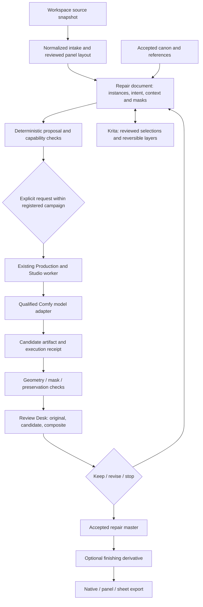

# Repair Studio architecture

Status: design for #243; the only new executable artifact in this slice is the offline declaration checker. See [reconciliation](RECONCILIATION.md) for implemented foundations. Technical sources are indexed in [research](RESEARCH.md); mechanisms below are proposed engineering decisions unless explicitly identified as existing code.

## 1. Product and reliability objectives

Optimize the total effort needed to obtain an accepted asset, including selection, masks, failed generations, waiting, inspection and cleanup. Do not optimize only pixels per second, detector confidence or the number of installed models.

There are three possible useful outcomes: an accepted repair; a preserved source with a precise blocked/uncertain diagnosis and editable intermediate artifacts; or an explicitly approved reconstruction branch when information is missing. A model failure is not allowed to become data loss, invisible scope expansion or endless retries. Manual/native finishing remains a first-class completion path.

Treat hard constraints lexicographically. First protect ownership, source integrity, write scope, runtime compatibility and budget. Then compare intended-change success, identity, costume, contact and seams. Only then compare aesthetics and speed. A weighted aesthetic score cannot compensate for editing the wrong person or breaking an exact preservation promise.

## 2. Architecture: one owner, multiple qualified operations

There is no new inference server, GPU queue, model registry or independent repair database. Extend Workspace for revisioned documents and artifacts, Production for campaign/stage ownership, Review Desk for decisions, registered presets for graph bindings and existing native adapters for source-aware layers. The repair document is a task-specific aggregate over these owners, not another copy of their state.

The existing `character_edit_bridge.py` is a client of Studio; its preparation and IO companions remain the adapter seam. The present neural bridge supports one actor and a Qwen context-plus-reference route, not arbitrary many-actor inpainting. Expand support through conformance-tested adapters instead of weakening current guards.

## 3. Source, target and evidence model

The immutable original is never a working buffer. Intake creates a named normalized derivative with recorded orientation, colour/alpha decisions and source linkage. Sheet extraction creates exact crops plus layout records, not inferred isolated subjects. A border-crossing hat or hand may belong to a neighboring panel; automatic boxes are proposals.

Separate `canon_id`, `costume_revision`, `panel_id` and `instance_id`. Ten views of one character are ten instances referencing one canon. A prop is its own scene entity. References bind to an instance and a role; they do not float in a global reference pool. Source appearance can be imperfect evidence; accepted canon and explicit owner choices establish the design authority.

An observation records the inspected source revision, region and transform, method/version, finding, visibility and reviewer. Keep `observed`, `inferred`, `authored`, `not_visible` and `uncertain` distinct. A tiny ambiguous finger is not proven missing. Intentional stylization and nonhuman anatomy use an appropriate rubric, not a universal five-finger rule.

The evidence record includes failures and rejected candidates. Neither a generated mask nor a valid hash proves semantic scope. Metadata, prompts and source documents are untrusted data, never instructions to execute code or grant approval.

## 4. Operation boundaries

**Intake/extract** handles original bytes, normalization, panel coordinates and useful previews. It does not remove a background or synthesize a hidden leg.

**Select/understand** proposes target-instance masks, visibility and contact annotations. Manual point/box/brush work is the baseline. Optional segmentation, matting or local vision calls have explicit cost and review. A rock beside the subject can remain useful context; a fragment of another subject may warrant a different context or reference.

**Plan** resolves preservation mode, editable scope, candidate strategies, reference roles and missing capabilities. Initially it is deterministic. A local language/vision helper may suggest intent or critique, but cannot make its own proposal authoritative.

**Prepare/execute** builds an exact adapter-specific bundle and uses the existing registered campaign and worker. Runtime checks are refreshed at dispatch, after queue waits. Model, encoder, VAE, patch, schema, geometry and references participate in effective identity. Layout-only UI edits do not.

**Inspect/compose** verifies candidate format and correspondence, then composites through the reviewed effective write mask. A candidate with the correct dimensions but shifted anatomy fails registration/contact review. A perfect outside-mask diff can coexist with a failed interior edit.

**Review/finish/export** retains the original, candidate and composite. Accept a repair master before optional upscaling. Remastering, layout and native delivery are separate dependency stages; changing a title must not regenerate a hand.

## 5. Preservation modes

- **Localized:** same normalized source canvas; exact decoded RGBA outside final write support and throughout protected regions. Interior success still requires review.
- **Remaster:** create a resized/restored derivative. Compare to an explicitly defined scaled baseline and design references. Do not claim original pixel equality after global resampling or colour change.
- **Reconstruction:** complete occluded/out-of-frame geometry, remove an occluder, change camera or substantially redesign a pose. Explain new information and widened scope. Preserve identity semantically and protect explicitly unaffected areas where feasible.

A user can start from one mode and propose a branch to another, but the system never silently downgrades an exact lock to a prompt suggestion. Global relighting and exact unchanged background pixels are conflicting requirements.

## 6. Smart repair means changing the hypothesis

Use a bounded decision policy, not a mandatory sequence of every installed model. First ask whether the image needs a generative operation at all. A layout mistake is deterministic; an intact panel should remain intact. For a confirmed local defect, start with one supported matched-style route. If it returns the same wrong structure, inspect scope, effective mask and reference framing before sampling again.

Each later attempt declares the failure being addressed and the material change: wider wrist context, new mask footprint, corrected pose/depth guide, less contaminated identity reference, different compatible editing route or native paint correction. Two near-identical failures should prompt an intervention or stop, not an automatic denoise staircase. This threshold is an initial policy hypothesis, configurable and evaluated under #250, not an empirical universal optimum.

Retain the accepted canon instead of using each generated result as the next authority. Do not automatically detail a correct face while repairing a hand. A source prompt should lose sheet-layout instructions when used on an individual panel; otherwise the repair can inherit irrelevant composition demands.

Strategy selection starts from capability and observed task evidence. Later, measured accepted-effort distributions can inform ranking, with unknown routes kept visibly experimental. Do not invent success probabilities from a model card or average away a critical failure class. Offer a small Pareto set when speed, fidelity and reconstruction freedom genuinely trade off.

## 7. Coupled subjects and incremental work

Contacts form a local relationship graph. A handshake or two hands on a prop has a coupled repair region and relevant actor references. Independent actor redraws are alternatives to compare, not a universally safer method. A shared contact pass may be needed after separate appearance work.

A global back-to-front order cannot represent interlocking arms. Keep local occlusion/contact relations and native layer/mask exceptions instead of forcing every scene into one acyclic actor order. A scene branch may change many pixels, but its intended geometry must still be reviewed.

Only patches with disjoint **effective** write supports and independent semantic dependencies can be composed from the same source revision without order dependence. Feathering or a shared prop can remove that independence. Overlapping patches require an explicit order with fresh source checks, or one coupled candidate.

The dependency graph is facet-scoped: canon face change invalidates identity-bearing outputs; costume revision invalidates garment-bearing views; mask change invalidates candidate/composition; export scale changes only finishing; panel position changes only layout. Record all effective dependencies, including the scope geometry and native document revision. A hash cannot detect an omitted dependency.

## 8. Operational architecture

Use current Production root reservations, including #240's registered campaign. Add missing global per-case repair allocation under #250, not another semaphore. Count real image-producing work, including failures, warmups and unknown outcomes. Auxiliary segmentation/VLM calls need their own finite call/time limits and the same resource owner; a CPU-only model is still work, not a free read.

Preserve intent before submission and known prompt IDs immediately. An uncertain response is an observation/reconciliation state, never permission to repeat the operation under another plan ID. Stop observing, cancel queued work, interrupt an owned running operation and declare local abandonment have different meanings. A local disposition is not proof that remote execution never happened.

Observe load/encode/sample/decode/export feasibility per exact runtime and shape. Physical RAM, Windows commit and VRAM are distinct. Historical hardware and advertised NVIDIA memory are not current AMD measurements. Defer auxiliary work under pressure. Do not automatically upgrade packages, change paging, unload a user's models or restart applications.

Crash consistency is scoped to the actual filesystem/database contracts. File hashes are not authentication; SQLite and external Comfy execution are not one distributed transaction. Retain uncertain receipts and incomplete artifacts rather than advertising unsupported exactly-once or power-loss guarantees.

## 9. Scope and non-goals

First release: one useful localized repair through current models and existing native/client paths. Later gates cover isolation, multi-instance contacts, bounded adaptation and generic high-resolution sheet exports. Reuse Krita for painting; use authored Blender geometry only when it improves an ambiguous structural task.

Not promised: universally correct anatomy, recovery of a unique missing original, automatic anatomical rigs from layers, lossless arbitrary native-document interchange, identical neural reruns across hardware, unattended art acceptance or unsupported model-family compatibility. These limits do not prevent an effective studio; they determine where mechanical proof, model evidence and explicit design decisions belong.
