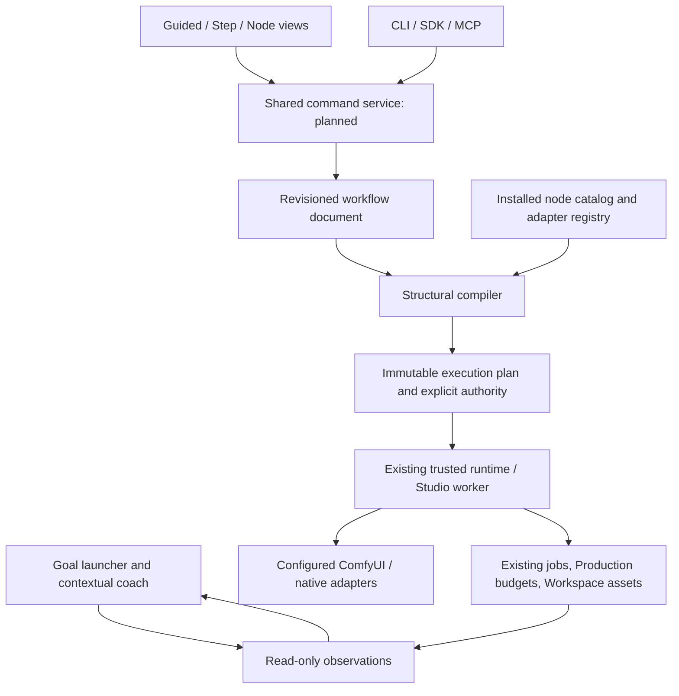

# Architecture: one workflow, three human views, one execution boundary

Status: initial authoring/guide/ticket slice implemented; full target architecture below is a proposal with release gates. Baseline inspected: `064d6026f54b77f19fb701cee5409d2a316c993f`.

## 1. Product model

A person should start with **what they want to make**, not which backend endpoint or model file they happen to recognize. An expert should be able to reveal every supported input and connection without rebuilding the work. An agent should operate the same domain objects through commands, not click a canvas.

The intended views are:

**Guided:** choose a goal, supply references, understand prerequisites, make a few meaningful decisions, inspect a plan, explicitly run, review and reuse. Guidance observes real state, but never owns a separate generation lifecycle.

**Steps:** a readable vertical sequence of reusable modules such as Load character → Preserve identity → Apply pose → Generate variations → Repair region → Export. Checkboxes control explicit modules, not arbitrary deletion. Named controls expose exact typed node inputs, including declared multi-bindings; defaults and limits are family-specific. This view is planned, not completed in the first slice.

**Nodes:** inspect/add/configure/connect the installed Comfy classes, expose advanced controls and resolve diagnostics. The first slice provides this basic API-graph editor with an accessible connection-list alternative to the diagram.

Switching views should change presentation, not semantic content. A module needing a native-only widget must say so rather than pretending it is editable through a generic text box.

## 2. Boundaries



Today the browser owns a bounded local draft and passes documents directly to the pure compiler API. The CLI can compile that same document. Only registered recipes may enter the implemented ticket façade, which delegates to `Studio.create_job`. The future shared command store and arbitrary authored-graph adapter are explicit gaps (#120, #122, #123).

### Module ownership

`studio_workflow/core.py`: strict JSON, schema normalization, document validation, typed closure compilation and hashes. No I/O, model execution or DOM semantics.

`guides.py`: authored goal/step copy and stable route/selector targets. No synthetic button clicks or task-success inference.

`http_extension.py`: bounded transport on the existing handler, using its security guards and its Studio instance. It reads the existing `node_info` cache; there is no second poller.

`execution.py`: narrow registered-preset ticket/intent façade. It delegates binding and queue ownership, and never makes a direct Comfy submission. Request receipts live under ignored runs data, not tracked source.

`__main__.py`: stdlib HTTP client, machine-readable output and exit statuses. No browser dependency.

`app/static/workflow-studio.*`: framework-free view, safe schema text rendering, browser draft/history, graph diagram, typed inspector and explicit export. `studio-guide.*` adds opt-in coaching to shared-shell pages. Existing Prompt, AV, Voice, Production and asset screens stay in place.

### Transitional composition decision

The server already calls `studio_prompt.http_extension.extend_handler`. This slice wraps its resulting handler with the Workflow handler there, rather than rewriting the large, actively changing server file. This preserves route dispatch and avoids collisions with concurrent runtime work. It is a tactical integration seam, not a claim that Prompt owns workflows. A later small composition root can centralize extension registration with explicit ordering and collision tests.

## 3. Workflow document contract

`studio.workflow/v1` contains a display name, local revision counter, backend ID and schema fingerprint; native API `nodes`; selected `outputs`; `disabled` node IDs; explicit `bypass` maps; layout `positions`; and optional source metadata. `_meta` on API nodes is retained. A v1 document is limited to 1 MiB and 256 nodes, with bounded nesting and position coordinates.

API nodes are separate from native visual workflow JSON. A selected output induces a dependency closure; disconnected or disabled drafts remain in the document. Compilation cannot silently promote an unselected output that another output depends on: the user must select it explicitly. Removing a node leaves dangling connections visible as errors.

A disabled passthrough maps a declared output index to a connected input name. The compiler checks the declared input/output types, the actual upstream output, and cycles. It does not guess bypasses from matching field names. An unconnected literal cannot masquerade as a connection.

The compiler reports `{code, message, node, field}` diagnostics, a document hash and—only for a valid supported closure—an executable graph hash. Structural validity is not runtime validity. It does not emulate arbitrary `VALIDATE_INPUTS`, lazy evaluation, custom widget code or model execution. Published list metadata is retained but full list-expansion semantics are not certified.

### Planned command contract (#120)

An atomic command batch should carry `document_id`, `expected_revision`, `command_id` and typed operations. A successful write returns the new immutable revision and semantic/layout diffs; a conflict returns current revision without applying a partial batch. Retry by command identity must be distinguishable from a new operation.

Operations should include node lifecycle, set/unset input, connect/disconnect, enable/disable, explicit bypass, select outputs, layout, exposed controls, reference slots and module fork/update. Server validation—not DOM state—is authoritative. Persist revisions and commands at the existing Workspace boundary rather than creating an unrelated project database. Browser history remains provisional until this service exists.

Separate **document identity**, **layout identity** and **executable identity**. Moving a node or reading another guide step must not invalidate an approved execution plan if its executable content is unchanged. The initial compiler already returns a separate graph hash, but the general execution plan service is future work.

## 4. Schema and native interoperability

Use actual installed `/object_info` metadata, the active backend and an explicit adapter capability registry. The first slice handles legacy/V3 tuples and a published NodeDef-v2 subset. Scalars, primitive combos and typed links get controls; unsupported behaviours remain data with diagnostics.

Do not inject custom-node JavaScript into the Studio origin, call a remote options URL merely because metadata mentions one, or infer an installed model from a node-class name. Numeric limits, optionality, labels and defaults are schema data, not authorization. Unknown inventory is unknown, not proof of absence.

Native visual files must be retained as separate original artifacts. Full round-trip needs versioned mappings for primitives, reroutes, widget conversion, mute/bypass modes, subgraph IDs, dynamic widgets and opaque extension metadata. Before choosing a full canvas library or embedding a frontend, compare a pinned native App Mode/subgraph adapter with a purpose-built editor against the installed frontend. Research documents options; it is not installation evidence. #121 owns this decision and its fixture matrix.

The plain-JS first slice avoids a framework rewrite or network-delivered dependencies before these boundaries are established. It is intentionally not a replacement for every native Comfy feature.

## 5. Execution and uncertainty

An approved general workflow must eventually compile into an immutable plan including graph, selected outputs, dependencies, adapter versions, referenced asset identities and explicit resource/budget constraints. It must enter the shared trusted executor (#22), not call `/prompt` directly from the browser. Comfy `/prompt` is a submission endpoint, not a dry-run validator; see [research](RESEARCH.md).

The implemented smaller path is:

```mermaid
sequenceDiagram
    participant Client as Human or agent
    participant Ticket as Ticket facade
    participant Worker as Existing Studio
    Client->>Ticket: prepare registered recipe
    Ticket->>Worker: prepare and inspect bindings
    Ticket-->>Client: pinned ticket; no generation
    Client->>Ticket: same ticket + explicit approval
    Ticket->>Ticket: under Studio lock: recheck pins
    Ticket->>Ticket: exclusive durable intent receipt
    Ticket->>Worker: create_job with deterministic job ID
    Worker-->>Client: retained job ID
    Client->>Ticket: repeat same ticket after response loss
    Ticket-->>Client: same job OR reconciliation_required
```

The receipt deliberately precedes the enqueue-capable call. If persistence or job creation fails after that point, the intent is not discarded. A receipt without a loaded job is parked. A retained job with unknown remote state stays unknown. The façade does not retry a Comfy submission and does not promise exactly-once execution.

Current pins cover template/graph/preset metadata, backend/workspace identity, prepared references and staged `LoadImage` bytes. They do not freeze every custom-node file, model weight, software revision or later filesystem mutation. The inherited worker and model-reference rules still apply. A ticket is not a resource reservation, model-license clearance or creative approval. Parent assets are checked before ticket creation, and their IDs remain part of the recipe.

For full authored execution (#122), require pre-dispatch resource/adapter checks, stable input staging, durable command recovery, bounded graph invocations and ownership-aware progress/cancellation. Reuse #10's budgets and existing jobs/assets. Never conflate cancelling queued work, interrupting running Comfy work and stopping local observation; global interrupt may affect other work.

## 6. UX and accessibility contract

Keep the primary path outcome-oriented and short. Explain consequences beside controls, show supported alternatives when a feature is unavailable and preserve inputs when a prerequisite fails. Show the selected environment without silently switching it. Review the exact graph/plan before submission; then show execution progress and creative acceptance as separate facts.

The coach is nonmodal, opt-in and pausable. Its target may be absent until a suitable recipe is selected; that is explained instead of clicking through prerequisites. The initial one-second target check is a bounded convenience, not a robust semantic-anchor/evidence system. #118 replaces it with stable feature-owned observations and tests against real workflows.

The builder offers named keyboard-operable controls, not pointer wiring alone; optional inputs and selected outputs are explicit. Browser-local persistence errors remain visible, and JSON download is the portable recovery path. The first implementation caps undo at 30 snapshots / approximately 4 MiB of serialized history. Unsupported int64 values are rejected in the browser before editing; the Python decoder preserves them.

Proposed release targets—not measurements from this pass—include no horizontal page overflow at 390px/200% zoom, keyboard-only creation/edit/export, no focus traps, reduced-motion support, bounded catalog rendering and documented 50/150/256-node response budgets. Large-graph virtualisation and optimized drag-edge rendering remain #120 work.

## 7. Security, provenance and rollout

Preserve loopback Host/same-origin guards. Reject duplicate/reserved JSON keys, nonfinite values, oversized bodies and excessive nesting. Render schema labels as text. Do not add uploads, arbitrary filesystem writes, backend URLs, package installs or shell execution under the guise of a graph control.

Hashes identify content; they do not authorize execution. Explicit approval still goes through the authenticated/local request boundary. A malicious process already controlling the workspace is not isolated by these hashes. Retained receipts must not be deleted merely to obtain another dispatch.

Roll out read-only guidance/catalog first, then editable but export-only graphs, persistent shared commands, compatibility-certified native adapters, and finally guarded authored execution. Each capability stays false until its fixtures and runtime evidence justify enabling it. Existing recovery and resource issues remain linked in [the roadmap](ROADMAP.md), not reimplemented or prematurely closed here.
