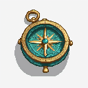
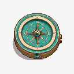

# First browser-driven compass batch

Generated through the simplified Asset Studio interface on 11 September 2026 using the Pixel Art XL preset. The prompt was edited in the browser and saved as **My first compass**. The batch requested two images; seeds were 2026091103 and 2026091104. Each produced a full-size result and a 128px export; their hashes differ.

The recipe was exported and imported through the UI. The two small exports were pinned side by side. This proves the browser-to-ComfyUI path, distinct batch seeds and result retrieval. It does not establish that either compass is a finished game asset.

Try importing `recipe.json`, then change LoRA strength only. Keep the seed fixed when evaluating its effect. Check the results at real game size and record cleanup effort.
